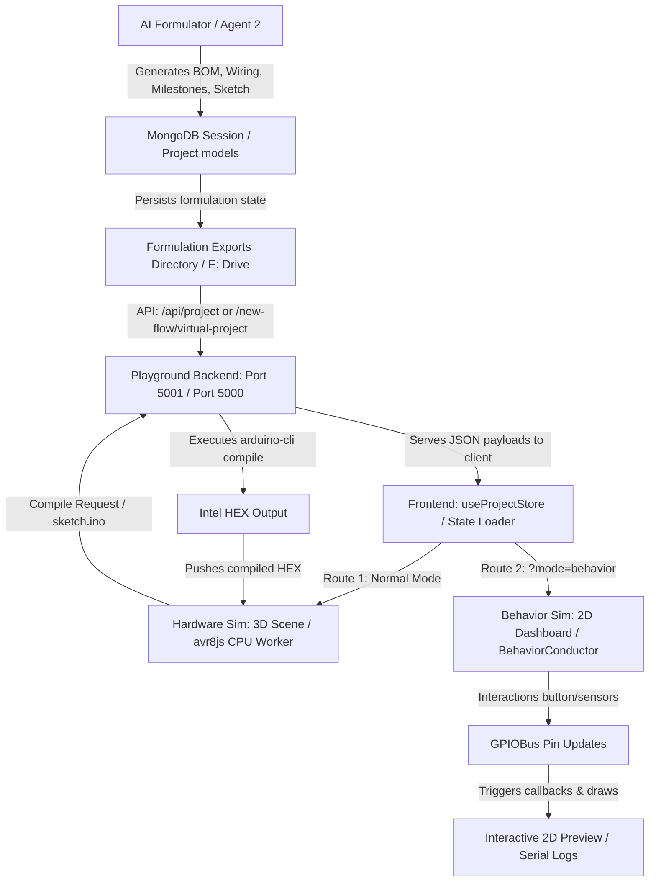

# Virtual Playground & Behavior Simulation: Architectural Documentation & File Reference

This document serves as the comprehensive repository and data flow overview for the **Virtual Playground** and the **Behavior Simulation** engines used in the `wireup.ai` workspace. It details the complete file listings, integration points, and step-by-step data movements across the backend, frontend, and the AI formulation pipeline.

---

## 1. High-Level Architecture & Integration Points

The `wireup.ai` simulation suite operates across two primary paradigms depending on the type of session running and the depth of simulation needed:

1. **Hardware (avr8js) Simulation**: A low-level, high-fidelity cycle-accurate emulation of an 8-bit AVR microcontroller (e.g., ATmega328P on the Arduino Uno).
2. **Behavior (Conductor-Driven) Simulation**: A high-level, event-driven state simulation optimized for complex operations (like playing audio, scanning Virtual FAT filesystems, drawing to I2C OLED screens, tracking battery consumption, and handling various environmental sensors) without requiring real low-level registers or compiler cycles.

### Architectural Diagram



---

## 2. Cross-Layer Data Movements

### A. Formulation Pipeline ➔ Backend Persistence
1. The **AI Formulation Agent** designs the electronics system. It yields:
   - `bom.json`: Components keys, displayName, mpn, glbUrl, and pins description.
   - `wiring.json`: Explicit net-lists mapping pin connections (e.g., `mcu.GPIO25 -> amp.SIG`).
   - `milestones.json`: Ordered project building milestones containing code snippets (`code`) and verification criteria (`expectedOutput`, `passCondition`).
   - `sketch.ino`: The main Arduino sketch.
2. The agent calls `saveSessionProgress` within the backend (`formulation.persistence.ts`).
3. This handler normalizes and saves these entities in MongoDB within the `NewFlowSession` and `Project` schemas, emitting update events via Socket.io to the frontend (`agent2:bom_update`, `agent2:wiring_update`).
4. Additionally, the backend writes exports directly to disk: `E:\wireup_formulation_exports\session_<id>\`.

### B. Backend ➔ Frontend (Playground Launch)
1. Upon loading, the React app checks URL parameters for `sessionId` and `mode`.
2. It calls the backend endpoint `GET /new-flow/virtual-project/:sessionId` (falling back to `/playground/project?sessionId=:sessionId`).
3. The backend compiles the latest formulation payload (BOM, wiring, milestones, sketch) and responds.
4. The frontend routes the data:
   - **Hardware Mode**: Feeds the 3D scene representation and loads `useProjectStore.ts`.
   - **Behavior Mode**: Triggers `deriveManifest()` inside `SimulationManifest.ts`, converting the hardware architecture list into a custom configuration metadata layout called the **Simulation Manifest**.

### C. The Hardware Compilation Loop (Hardware Sim)
1. In Wokwi/AVR mode, the user writes code in the Monaco Editor.
2. Clicking **Deploy** sends a `POST` request to `http://localhost:5000/api/compile` (with a dev fallback to `http://localhost:5001/api/compile`).
3. The server sets up a temp compilation directory, writes the sketch, runs `arduino-cli compile --fqbn arduino:avr:uno`, fetches necessary libraries (e.g., `LiquidCrystal_I2C`), and yields an Intel HEX file.
4. The frontend passes the HEX string to `cpu.worker.ts` via Web Workers.
5. The CPU worker runs the `avr8js` emulator instruction-ticking loop, posting serial lines and pin states (`HIGH` / `LOW`) back to the frontend.

### D. GPIOBus Events & Sensor Calculations (Behavior Sim)
1. In Behavior Mode, `BehaviorConductor` runs a synchronized `GPIOBus`.
2. **Inputs**: Drag-and-dropping files uploads them to `VirtualFSPeripheral`. Sliders in the sensor tab write values directly to mapped pin keys on the `GPIOBus`.
3. **Triggered Calculations**: Changing a slider calculates respective sensor outputs (e.g., Potentiometer voltage/angle, Photoresistor LUX ambient level, DHT22 temperature conversion, MQ gas air contamination alerts) and prints them as telemetry logs to the Serial Monitor.
4. **Outputs**: Adjustments in virtual pin values trigger callbacks. For instance, `OLEDPeripheral` repaints the 2D canvas at 10fps, `AudioPeripheral` controls browser audio synthesis, and the `BatteryPeripheral` drains charge based on current draw class.

---

## 3. Core Simulation Codebases

Below is the complete file list and verbatim code packaged together.

---

### File 1: Simulation Manifest Derivation
**Path**: `virtual-playground/frontend/src/simulation/behavior/SimulationManifest.ts`

```typescript
// ??$$$ newer code - SimulationManifest translation logic for behavior playground
export type PeripheralType =
  | 'SSD1306Canvas'
  | 'WebAudioOut'
  | 'VirtualFS'
  | 'ClickButton'
  | 'BatteryGauge'
  | 'SerialMonitor'
  | 'LEDIndicator'
  | 'SensorInput'; // ??$$$ newer code

export interface PeripheralConfig {
  key: string;
  type: PeripheralType;
  pins: string[]; // GPIO pins this peripheral listens to or drives (stripped of mcu. prefix)
  config: Record<string, any>;
}

// ??$$$ newer code
export const SimulationManifest = {
  // Dummy definition for bundler resolution
};

export interface SimulationManifest {
  projectName: string;
  mcu: string;
  archetype: string;
  peripherals: PeripheralConfig[];
  serialBehavior: string[]; // lines the firmware would print in order
  powerDrawMa: number;
  batteryCapacityMah: number;
}

// Derives a SimulationManifest from the formulation session data
export function deriveManifest(project: any, blueprint: any): SimulationManifest {
  const bom = Array.isArray(project?.bom) ? project.bom : [];
  const wiring = Array.isArray(project?.wiring) ? project.wiring : [];
  const milestones = Array.isArray(project?.milestones) ? project.milestones : [];
  const archetype = blueprint?.archetype || 'generic-io';

  const peripherals: PeripheralConfig[] = [];

  // MCU is always present
  const mcuItem = bom.find((b: any) => b.key === 'mcu' || b.type === 'microcontroller');
  const mcuKey = mcuItem?.key || 'mcu';

  // Find wiring connections from/to a given BOM key
  const getWiresFor = (key: string) =>
    wiring.filter((w: any) => w.from?.startsWith(key + '.') || w.to?.startsWith(key + '.'));

  // OLED / display
  const oledItem = bom.find((b: any) =>
    b.key === 'oled' || b.mpn?.includes('SSD1306') || b.displayName?.toLowerCase().includes('oled')
  );
  if (oledItem) {
    const wires = getWiresFor(oledItem.key);
    const sdaPins = wires
      .filter((w: any) => w.from?.includes('SDA') || w.to?.includes('SDA'))
      .map((w: any) => w.from?.startsWith('mcu.') ? w.from.replace('mcu.', '') : w.to?.replace('mcu.', ''))
      .filter(Boolean) as string[];
    peripherals.push({
      key: oledItem.key,
      type: 'SSD1306Canvas',
      pins: sdaPins.length > 0 ? sdaPins : ['GPIO21', 'GPIO22'],
      config: { width: 128, height: 64, i2cAddr: '0x3C' }
    });
  }

  // Audio output (amp + speaker, or DAC pins)
  const ampItem = bom.find((b: any) =>
    b.key === 'amp' || b.mpn?.includes('PAM8403') || b.mpn?.includes('MAX98357') || b.displayName?.toLowerCase().includes('amplif')
  );
  const speakerItem = bom.find((b: any) =>
    b.key === 'speaker' || b.displayName?.toLowerCase().includes('speaker')
  );
  if (ampItem || speakerItem) {
    // Find DAC pins wired to amp
    const dacWires = wiring.filter((w: any) =>
      (w.from?.includes('GPIO25') || w.from?.includes('GPIO26') ||
       w.from?.includes('DAC') || w.from?.includes('dac') ||
       w.to?.includes('GPIO25') || w.to?.includes('GPIO26') ||
       w.to?.includes('DAC') || w.to?.includes('dac'))
    );
    const dacPins = dacWires.map((w: any) => {
      const pin = w.from?.startsWith('mcu.') ? w.from : w.to;
      return pin ? pin.replace('mcu.', '') : null;
    }).filter(Boolean) as string[];
    peripherals.push({
      key: 'audio_out',
      type: 'WebAudioOut',
      pins: dacPins.length > 0 ? dacPins : ['GPIO25', 'GPIO26'],
      config: { dacPins: dacPins.length > 0 ? dacPins : ['GPIO25', 'GPIO26'] }
    });
  }

  // MicroSD / VirtualFS
  const sdItem = bom.find((b: any) =>
    b.key === 'microsd' || b.key === 'sdcard' || b.mpn?.includes('MICROSD') || b.displayName?.toLowerCase().includes('sd card')
  );
  if (sdItem) {
    const csWire = wiring.find((w: any) =>
      (w.from?.includes('CS') && (w.to?.startsWith('mcu.') || w.to?.startsWith('mcu.'))) ||
      (w.to?.includes('CS') && (w.from?.startsWith('mcu.') || w.from?.startsWith('mcu.')))
    );
    const csPinFull = csWire ? (csWire.from?.startsWith('mcu.') ? csWire.from : csWire.to) : 'mcu.GPIO5';
    const csPin = csPinFull.replace('mcu.', '');
    peripherals.push({
      key: sdItem.key,
      type: 'VirtualFS',
      pins: [csPin],
      config: { accepts: ['mp3', 'wav', 'flac'], csPin }
    });
  }

  // Buttons — only actual button/switch components, not passives
  const buttonItems = bom.filter((b: any) => {
    const name = `${b.displayName || ''} ${b.mpn || ''} ${b.purpose || ''}`.toLowerCase();
    // Must look like a button
    const isButton = b.type === 'button' || name.includes('button') || name.includes('switch') || name.includes('tactile');
    // Exclude passives that may mention "button" context
    const isPassive = name.includes('resistor') || name.includes('capacitor') || name.includes('diode') ||
      b.type === 'resistor' || b.type === 'capacitor';
    return isButton && !isPassive;
  });
  const keyMap: Record<string, string> = {
    'btnPlay': 'Space',
    'btnNext': 'ArrowRight',
    'btnPrev': 'ArrowLeft',
    'btnVolUp': 'ArrowUp',
    'btnVolDown': 'ArrowDown',
    'btnPower': 'p',
    'btnPair': 'b',
  };

  // Normalize AI-generated button keys (btn_play, btn_vup, etc.) to canonical camelCase keys
  const normalizeButtonKey = (raw: string): string => {
    const s = raw.toLowerCase().replace(/[_\-\s]/g, '');
    if (s.includes('play') || s.includes('pause')) return 'btnPlay';
    if (s.includes('next')) return 'btnNext';
    if (s.includes('prev') || s.includes('back')) return 'btnPrev';
    if (s.includes('volup') || s.includes('vup') || s.includes('volumeup')) return 'btnVolUp';
    if (s.includes('voldown') || s.includes('vdown') || s.includes('volumedown')) return 'btnVolDown';
    if (s.includes('power') || s.includes('pwr')) return 'btnPower';
    if (s.includes('pair') || s.includes('bt') || s.includes('bluetooth')) return 'btnPair';
    return raw; // unknown — keep as-is
  };
  for (const btn of buttonItems) {
    const canonicalKey = normalizeButtonKey(btn.key);
    const gpioWire = wiring.find((w: any) =>
      (w.from?.startsWith('mcu.') && w.to?.startsWith(btn.key + '.')) ||
      (w.to?.startsWith('mcu.') && w.from?.startsWith(btn.key + '.'))
    );
    const gpioPinFull = gpioWire ? (gpioWire.from?.startsWith('mcu.') ? gpioWire.from : gpioWire.to) : '';
    const gpioPin = gpioPinFull ? gpioPinFull.replace('mcu.', '') : '';
    peripherals.push({
      key: canonicalKey,
      type: 'ClickButton',
      pins: gpioPin ? [gpioPin] : [],
      config: {
        label: btn.displayName?.replace('Tactile Button - ', '').replace('Button - ', '') || btn.key,
        keyboardKey: keyMap[canonicalKey] || '',
        gpioPin,
        activeHigh: false
      }
    });
  }

  // LEDs / output indicators
  const ledItems = bom.filter((b: any) => {
    const name = `${b.displayName || ''} ${b.mpn || ''} ${b.purpose || ''} ${b.key || ''}`.toLowerCase();
    return b.type === 'led' || name.includes('led') || name.includes('bulb') || name.includes('light') && !name.includes('photoresistor') && !name.includes('ldr');
  });
  for (const led of ledItems) {
    const gpioWire = wiring.find((w: any) =>
      (w.from?.startsWith('mcu.') && w.to?.startsWith(led.key + '.')) ||
      (w.to?.startsWith('mcu.') && w.from?.startsWith(led.key + '.'))
    );
    const gpioPinFull = gpioWire ? (gpioWire.from?.startsWith('mcu.') ? gpioWire.from : gpioWire.to) : '';
    const gpioPin = gpioPinFull ? gpioPinFull.replace('mcu.', '') : '';
    const nameLower = `${led.displayName || ''} ${led.key || ''}`.toLowerCase();
    const color = nameLower.includes('red') ? 'red'
      : nameLower.includes('green') ? 'green'
      : nameLower.includes('blue') ? 'blue'
      : nameLower.includes('yellow') ? 'yellow'
      : nameLower.includes('white') ? 'white'
      : 'green';
    peripherals.push({
      key: led.key,
      type: 'LEDIndicator',
      pins: gpioPin ? [gpioPin] : [],
      config: {
        label: led.displayName?.replace('LED - ', '').replace('Light - ', '') || led.key,
        gpioPin,
        color,
        activeHigh: true
      }
    });
  }

  // Battery
  const batteryItem = bom.find((b: any) =>
    b.key === 'battery' || b.mpn?.includes('LIPO') || b.displayName?.toLowerCase().includes('battery')
  );
  const chargerItem = bom.find((b: any) =>
    b.key === 'charger' || b.mpn?.includes('TP4056') || b.displayName?.toLowerCase().includes('charger')
  );
  if (batteryItem) {
    const capacityMah = batteryItem.displayName?.match(/(\d+)\s*mah/i)?.[1]
      ? parseInt(batteryItem.displayName.match(/(\d+)\s*mah/i)![1])
      : 1000;
    // ??$$$ newer code
    peripherals.push({
      key: batteryItem.key,
      type: 'BatteryGauge',
      pins: [],
      config: { capacityMah, chargingPin: chargerItem ? 'charger.CHRG' : '' }
    });
  }

  // ??$$$ newer code
  // Sensors (DHT, LM35, Potentiometer, Photoresistor, Ultrasonic, PIR, Soil, Gas, etc.)
  const sensorItems = bom.filter((b: any) => {
    const typeHint = `${b.displayName || ''} ${b.purpose || ''} ${b.mpn || ''} ${b.key || ''}`.toLowerCase();
    return b.type === 'sensor' ||
      typeHint.includes('sensor') ||
      typeHint.includes('temp') ||
      typeHint.includes('humidity') ||
      typeHint.includes('potentiometer') ||
      typeHint.includes('light') ||
      typeHint.includes('dht') ||
      typeHint.includes('lm35') ||
      typeHint.includes('ldr') ||
      typeHint.includes('ultrasonic') ||
      typeHint.includes('distance') ||
      typeHint.includes('motion') ||
      typeHint.includes('pir') ||
      typeHint.includes('soil') ||
      typeHint.includes('moisture') ||
      typeHint.includes('gas') ||
      typeHint.includes('smoke') ||
      typeHint.includes('mq');
  });

  for (const s of sensorItems) {
    const gpioWire = wiring.find((w: any) =>
      (w.from?.startsWith('mcu.') && w.to?.startsWith(s.key + '.')) ||
      (w.to?.startsWith('mcu.') && w.from?.startsWith(s.key + '.'))
    );
    const gpioPinFull = gpioWire ? (gpioWire.from?.startsWith('mcu.') ? gpioWire.from : gpioWire.to) : '';
    const gpioPin = gpioPinFull ? gpioPinFull.replace('mcu.', '') : '';

    const nameLower = `${s.displayName || ''} ${s.key || ''} ${s.purpose || ''}`.toLowerCase();
    const isTempHumid = nameLower.includes('dht') || nameLower.includes('temp') || nameLower.includes('humidity') || nameLower.includes('lm35');
    const isPot = nameLower.includes('potentiometer') || nameLower.includes('pot');
    const isLight = nameLower.includes('light') || nameLower.includes('ldr') || nameLower.includes('photoresistor');
    const isDistance = nameLower.includes('ultrasonic') || nameLower.includes('distance') || nameLower.includes('hc-sr04') || nameLower.includes('hcsr04');
    const isMotion = nameLower.includes('motion') || nameLower.includes('pir');
    const isSoil = nameLower.includes('soil') || nameLower.includes('moisture');
    const isGas = nameLower.includes('gas') || nameLower.includes('smoke') || nameLower.includes('mq');

    let sensorType = 'Analog';
    let min = 0;
    let max = 1023;
    let defaultValue = 512;

    if (isTempHumid) {
      sensorType = 'DHT22';
      min = -40;
      max = 80;
      defaultValue = 24;
    } else if (isPot) {
      sensorType = 'Potentiometer';
      min = 0;
      max = 1023;
      defaultValue = 512;
    } else if (isLight) {
      sensorType = 'Photoresistor';
      min = 0;
      max = 1023;
      defaultValue = 600;
    } else if (isDistance) {
      sensorType = 'Distance';
      min = 2;
      max = 400;
      defaultValue = 100;
    } else if (isMotion) {
      sensorType = 'Motion';
      min = 0;
      max = 1;
      defaultValue = 0;
    } else if (isSoil) {
      sensorType = 'Soil Moisture';
      min = 0;
      max = 100;
      defaultValue = 45;
    } else if (isGas) {
      sensorType = 'Gas';
      min = 0;
      max = 1000;
      defaultValue = 150;
    }

    peripherals.push({
      key: s.key,
      type: 'SensorInput' as any,
      pins: gpioPin ? [gpioPin] : [],
      config: {
        label: s.displayName?.replace('Sensor - ', '') || s.key,
        sensorType,
        gpioPin,
        min,
        max,
        defaultValue
      }
    });
  }

  // Serial monitor (always present)
  peripherals.push({
    key: 'serial',
    type: 'SerialMonitor',
    pins: ['UART_TX'],
    config: { baudRate: 115200 }
  });

  // Extract likely serial output from milestone code comments and expected outputs
  const serialBehavior: string[] = milestones
    .sort((a: any, b: any) => (a.order || 0) - (b.order || 0))
    .flatMap((m: any) => {
      const lines: string[] = [];
      if (m.expectedOutput) {
        lines.push(...String(m.expectedOutput).split('\n').slice(0, 5).filter(Boolean));
      }
      return lines;
    })
    .slice(0, 30);

  // Power draw estimation
  const powerDrawMa = blueprint?.powerProfile?.drawClass === 'high-spike' ? 500
    : blueprint?.powerProfile?.drawClass === 'medium' ? 210
    : 80;

  const batteryCapacity = batteryItem
    ? (batteryItem.displayName?.match(/(\d+)\s*mah/i)?.[1]
         ? parseInt(batteryItem.displayName.match(/(\d+)\s*mah/i)![1])
         : 1000)
    : 1000;

  return {
    projectName: project?.name || 'Hardware Project',
    mcu: mcuItem?.displayName || blueprint?.computeRequirements?.mcu || 'ESP32',
    archetype,
    peripherals,
    serialBehavior,
    powerDrawMa,
    batteryCapacityMah: batteryCapacity
  };
}
```

---

### File 2: Behavior Conductor
**Path**: `virtual-playground/frontend/src/simulation/behavior/BehaviorConductor.ts`

```typescript
// ??$$$ newer code - BehaviorConductor orchestration class for high-level simulation
import { gpioBus, GPIOBus } from './GPIOBus';
import { SimulationManifest } from './SimulationManifest';
import { AudioPeripheral } from './peripherals/AudioPeripheral';
import { BatteryPeripheral } from './peripherals/BatteryPeripheral';
import { BehaviorButtonPeripheral } from './peripherals/BehaviorButtonPeripheral';
import { VirtualFSPeripheral } from './peripherals/VirtualFSPeripheral';
import { SimState } from './SimState';

export interface ConductorCallbacks {
  onOLEDUpdate: () => void;
  onBatteryUpdate: (pct: number) => void;
  onSerialLine: (text: string) => void;
  onStateUpdate: (state: SimState) => void;
}

export class BehaviorConductor {
  private manifest: SimulationManifest;
  private virtualFS: VirtualFSPeripheral;
  private battery: BatteryPeripheral;
  
  public audioPeripheral: AudioPeripheral | null = null;
  public buttonPeripheral: BehaviorButtonPeripheral | null = null;
  
  private callbacks: ConductorCallbacks | null = null;
  private state: SimState;
  
  private loopInterval: any = null;
  private serialLinesSent = 0;
  private serialTimer: any = null;
  private audioUnsubs: (() => void)[] = [];
  private pinUnsubs: (() => void)[] = [];

  constructor(manifest: SimulationManifest, virtualFS: VirtualFSPeripheral) {
    this.manifest = manifest;
    this.virtualFS = virtualFS;
    this.battery = new BatteryPeripheral(manifest.powerDrawMa, manifest.batteryCapacityMah);
    
    this.state = {
      trackName: '',
      progress: 0,
      volume: 75,
      batteryPct: 100,
      btConnected: false,
      playing: false,
      mode: 'ACTIVE',
      outputStates: {}
    };
  }

  start(callbacks: ConductorCallbacks): GPIOBus {
    this.callbacks = callbacks;
    gpioBus.reset();

    // Setup outputs initial states mapping
    const ledPeripherals = this.manifest.peripherals.filter(p => p.type === 'LEDIndicator');
    for (const led of ledPeripherals) {
      if (this.state.outputStates) {
        this.state.outputStates[led.config.label || led.key] = false;
      }
    }

    // Set initial values on bus for peripherals
    for (const p of this.manifest.peripherals) {
      for (const pin of p.pins) {
        if (p.type === 'ClickButton') {
          // Buttons are pulled-up (true/HIGH by default)
          gpioBus.write(pin, true);
        } else if (p.type === 'SensorInput') {
          gpioBus.write(pin, p.config.defaultValue ?? 512);
        } else {
          gpioBus.write(pin, false);
        }
      }
    }

    // Initialize peripherals
    this.buttonPeripheral = new BehaviorButtonPeripheral(this.manifest);
    this.battery.start();
    
    const batteryUnsub = this.battery.onUpdate((pct) => {
      this.state.batteryPct = pct;
      this.callbacks?.onBatteryUpdate(pct);
      this.notifyState();
    });

    if (this.manifest.archetype === 'audio-device') {
      this.audioPeripheral = new AudioPeripheral();
      
      // Load any existing files in virtualFS into the audio buffer
      for (const filename of this.virtualFS.listFiles()) {
        const buf = this.virtualFS.readFile(filename);
        if (buf) {
          this.audioPeripheral.loadFile(filename, buf);
        }
      }

      // Sync FS uploads
      const fsUnsub = this.virtualFS.onFileAdded((name, buffer) => {
        this.audioPeripheral?.loadFile(name, buffer);
        this.callbacks?.onSerialLine(`[FS] Saved file: ${name} (${Math.round(buffer.byteLength / 1024)} KB)`);
      });

      this.audioPeripheral.bindButtonPins(this.manifest, (btnKey) => {
        this.callbacks?.onSerialLine(`[INPUT] Button press: ${btnKey}`);
      });

      // Subscriptions
      const trackSub = this.audioPeripheral.onTrackChange((track) => {
        this.state.trackName = track;
        this.notifyState();
        this.callbacks?.onSerialLine(`[AUDIO] Track changed: ${track}`);
      });

      const progSub = this.audioPeripheral.onProgress((prog) => {
        this.state.progress = prog;
        this.notifyState();
      });

      const volSub = this.audioPeripheral.onVolumeChange((vol) => {
        this.state.volume = vol;
        this.notifyState();
        this.callbacks?.onSerialLine(`[AUDIO] Volume set to: ${vol}%`);
      });

      const playSub = this.audioPeripheral.onPlayStateChange((playing) => {
        this.state.playing = playing;
        this.notifyState();
        this.callbacks?.onSerialLine(`[AUDIO] Playback state: ${playing ? 'PLAYING' : 'PAUSED'}`);
      });

      this.audioUnsubs = [fsUnsub, trackSub, progSub, volSub, playSub];
    } else {
      // Non-audio mode — monitor output pins (e.g., LED) to update visual output states
      for (const led of ledPeripherals) {
        const pin = led.config.gpioPin;
        if (pin) {
          const unsub = gpioBus.on(pin, (val) => {
            if (this.state.outputStates) {
              const isOn = Boolean(val);
              this.state.outputStates[led.config.label || led.key] = isOn;
              this.notifyState();
              this.callbacks?.onSerialLine(`[SYSTEM] LED indicator ${led.config.label || led.key} is now ${isOn ? 'ON' : 'OFF'}`);
            }
          });
          this.pinUnsubs.push(unsub);
        }
      }
    }

    this.audioUnsubs.push(batteryUnsub);

    // Boot logs
    this.callbacks.onSerialLine('[SYSTEM] Booting behavior simulation conductor...');
    this.callbacks.onSerialLine(`[SYSTEM] Target compute architecture: ${this.manifest.mcu}`);
    this.callbacks.onSerialLine(`[SYSTEM] Device archetype class: ${this.manifest.archetype}`);
    this.callbacks.onSerialLine('[SYSTEM] Initializing I2C bus controllers on pins SCL/SDA...');
    this.callbacks.onSerialLine('[SYSTEM] Mounting SPI virtual SD card storage host...');

    // Run interval-based serial activity logs
    let milestoneIndex = 0;
    this.serialTimer = setInterval(() => {
      if (!this.callbacks) return;

      if (milestoneIndex < this.manifest.serialBehavior.length) {
        const nextLine = this.manifest.serialBehavior[milestoneIndex];
        this.callbacks.onSerialLine(nextLine);
        milestoneIndex++;
      } else {
        // Cyclic heartbeat
        if (this.manifest.archetype === 'audio-device') {
          if (this.state.playing) {
            this.callbacks.onSerialLine(`[STATUS] Playing ${this.state.trackName} | Battery: ${Math.round(this.state.batteryPct)}%`);
          } else {
            this.callbacks.onSerialLine(`[STATUS] Idle | BT Connected: ${this.state.btConnected} | Battery: ${Math.round(this.state.batteryPct)}%`);
          }
        } else {
          const outputsSummary = Object.entries(this.state.outputStates || {})
            .map(([label, on]) => `${label}=${on ? '1' : '0'}`)
            .join(', ');
          this.callbacks.onSerialLine(`[STATUS] Active loops running... ${outputsSummary ? `[Outputs: ${outputsSummary}]` : ''} | Battery: ${Math.round(this.state.batteryPct)}%`);
        }
      }
    }, 4000);

    // Conductor control loops (10fps UI sync)
    this.loopInterval = setInterval(() => {
      if (this.manifest.archetype === 'audio-device' && this.audioPeripheral) {
        const currentProg = this.audioPeripheral.getProgress();
        if (currentProg !== this.state.progress) {
          this.state.progress = currentProg;
          this.notifyState();
        }
      }
      this.callbacks?.onOLEDUpdate();
    }, 100);

    // Handle high-level events
    if (this.manifest.archetype === 'audio-device') {
      this.setupAudioBehaviorEvents();
    }

    return gpioBus;
  }

  private setupAudioBehaviorEvents() {
    // Bluetooth Pair key bind
    const btPin = this.manifest.peripherals.find(p => p.key === 'btnPair')?.config.gpioPin;
    if (btPin) {
      gpioBus.on(btPin, (val) => {
        if (val === false) { // Low means pressed
          this.state.btConnected = !this.state.btConnected;
          this.notifyState();
          this.callbacks?.onSerialLine(`[BLUETOOTH] Bluetooth link state: ${this.state.btConnected ? 'PAIRED' : 'DISCONNECTED'}`);
        }
      });
    }

    // Play next track
    const nextPin = this.manifest.peripherals.find(p => p.key === 'btnNext')?.config.gpioPin;
    if (nextPin) {
      gpioBus.on(nextPin, (val) => {
        if (val === false && this.audioPeripheral) {
          const list = this.virtualFS.listFiles();
          if (list.length === 0) return;
          const current = this.audioPeripheral.getCurrentTrack();
          let idx = list.indexOf(current) + 1;
          if (idx >= list.length) idx = 0;
          this.audioPeripheral.play(list[idx]);
        }
      });
    }

    // Play previous track
    const prevPin = this.manifest.peripherals.find(p => p.key === 'btnPrev')?.config.gpioPin;
    if (prevPin) {
      gpioBus.on(prevPin, (val) => {
        if (val === false && this.audioPeripheral) {
          const list = this.virtualFS.listFiles();
          if (list.length === 0) return;
          const current = this.audioPeripheral.getCurrentTrack();
          let idx = list.indexOf(current) - 1;
          if (idx < 0) idx = list.length - 1;
          this.audioPeripheral.play(list[idx]);
        }
      });
    }
  }

  private notifyState() {
    this.callbacks?.onStateUpdate({ ...this.state });
  }

  stop() {
    this.battery.stop();
    if (this.audioPeripheral) {
      this.audioPeripheral.destroy();
      this.audioPeripheral = null;
    }
    if (this.buttonPeripheral) {
      this.buttonPeripheral.destroy();
      this.buttonPeripheral = null;
    }

    if (this.loopInterval) {
      clearInterval(this.loopInterval);
      this.loopInterval = null;
    }
    if (this.serialTimer) {
      clearInterval(this.serialTimer);
      this.serialTimer = null;
    }

    for (const unsub of this.audioUnsubs) unsub();
    this.audioUnsubs = [];

    for (const unsub of this.pinUnsubs) unsub();
    this.pinUnsubs = [];

    this.callbacks = null;
    gpioBus.reset();
  }
}
```

---

### File 3: GPIO Bus
**Path**: `virtual-playground/frontend/src/simulation/behavior/GPIOBus.ts`

```typescript
// ??$$$ newer code - GPIOBus implementation for Behavior simulation
type PinValue = boolean | number; // boolean for digital, 0-255 for DAC/PWM
type PinListener = (value: PinValue) => void;

export class GPIOBus {
  private listeners = new Map<string, Set<PinListener>>();
  private state = new Map<string, PinValue>();

  write(pin: string, value: PinValue) {
    this.state.set(pin, value);
    const pinListeners = this.listeners.get(pin);
    if (pinListeners) {
      for (const listener of pinListeners) {
        listener(value);
      }
    }
  }

  read(pin: string): PinValue {
    return this.state.get(pin) ?? false;
  }

  on(pin: string, listener: PinListener) {
    if (!this.listeners.has(pin)) {
      this.listeners.set(pin, new Set());
    }
    this.listeners.get(pin)!.add(listener);
    return () => this.listeners.get(pin)?.delete(listener);
  }

  reset() {
    this.state.clear();
    this.listeners.clear();
  }
}

export const gpioBus = new GPIOBus();
```

---

### File 4: Simulation State Interface
**Path**: `virtual-playground/frontend/src/simulation/behavior/SimState.ts`

```typescript
// ??$$$ newer code
export interface SimState {
  trackName: string;
  progress: number;
  volume: number;
  batteryPct: number;
  btConnected: boolean;
  playing: boolean;
  mode: string;
  sensorValues?: Record<string, any>;
  outputStates?: Record<string, boolean>; // label -> on/off for LEDs
}
```

---

### File 5: Web Audio API Peripheral
**Path**: `virtual-playground/frontend/src/simulation/behavior/peripherals/AudioPeripheral.ts`

```typescript
// ??$$$ newer code - AudioPeripheral utilizing Web Audio API and event pins
import { gpioBus } from '../GPIOBus';
import type { SimulationManifest } from '../SimulationManifest';

export class AudioPeripheral {
  private ctx: AudioContext | null = null;
  private buffers = new Map<string, AudioBuffer>();
  private activeSource: AudioBufferSourceNode | null = null;
  private gainNode: GainNode | null = null;
  private volume = 75; // 0-100
  private playing = false;
  private currentTrack = '';
  private startOffset = 0;
  private startTime = 0;
  private duration = 0;
  
  private trackChangeListeners = new Set<(trackName: string) => void>();
  private progressListeners = new Set<(progress: number) => void>();
  private volumeListeners = new Set<(volume: number) => void>();
  private playStateListeners = new Set<(playing: boolean) => void>();

  private getContext() {
    if (!this.ctx) {
      // @ts-ignore
      const AudioCtx = window.AudioContext || window.webkitAudioContext;
      this.ctx = new AudioCtx();
    }
    if (this.ctx.state === 'suspended') {
      this.ctx.resume();
    }
    return this.ctx;
  }

  async loadFile(name: string, arrayBuffer: ArrayBuffer) {
    try {
      const context = this.getContext();
      const bufferCopy = arrayBuffer.slice(0);
      const audioBuffer = await context.decodeAudioData(bufferCopy);
      this.buffers.set(name, audioBuffer);
    } catch (e) {
      console.error('Failed to decode audio file:', name, e);
    }
  }

  play(filename: string) {
    if (!filename) return;
    const buffer = this.buffers.get(filename);
    if (!buffer) {
      console.warn(`Buffer not found for file: ${filename}`);
      return;
    }

    this.stopActiveSource();

    const context = this.getContext();
    this.activeSource = context.createBufferSource();
    this.activeSource.buffer = buffer;

    this.gainNode = context.createGain();
    this.setGainVolume();

    this.activeSource.connect(this.gainNode);
    this.gainNode.connect(context.destination);

    this.duration = buffer.duration;
    this.currentTrack = filename;
    this.startTime = context.currentTime - this.startOffset;
    
    this.activeSource.start(0, this.startOffset);
    this.playing = true;

    this.activeSource.onended = () => {
      // Natural track end
      if (this.playing && context.currentTime - this.startTime >= this.duration - 0.15) {
        this.startOffset = 0;
        this.playing = false;
        this.notifyPlayState();
        this.notifyProgress(1);
      }
    };

    this.notifyTrackChange(filename);
    this.notifyPlayState();
  }

  pause() {
    if (!this.playing) return;
    const context = this.getContext();
    this.startOffset = context.currentTime - this.startTime;
    if (this.startOffset >= this.duration) {
      this.startOffset = 0;
    }
    this.stopActiveSource();
    this.playing = false;
    this.notifyPlayState();
  }

  stop() {
    this.startOffset = 0;
    this.stopActiveSource();
    this.playing = false;
    this.notifyPlayState();
    this.notifyProgress(0);
  }

  setVolume(vol: number) {
    this.volume = Math.max(0, Math.min(100, vol));
    this.setGainVolume();
    this.notifyVolume();
  }

  private setGainVolume() {
    if (this.gainNode) {
      this.gainNode.gain.value = this.volume / 100;
    }
  }

  private stopActiveSource() {
    if (this.activeSource) {
      try {
        this.activeSource.stop();
      } catch (e) {
        // Already stopped
      }
      this.activeSource.disconnect();
      this.activeSource = null;
    }
  }

  getProgress(): number {
    if (!this.playing || this.duration === 0) {
      return this.startOffset / (this.duration || 1);
    }
    const context = this.getContext();
    const elapsed = context.currentTime - this.startTime;
    return Math.min(1, Math.max(0, elapsed / this.duration));
  }

  // Callbacks
  onTrackChange(cb: (trackName: string) => void) {
    this.trackChangeListeners.add(cb);
    return () => this.trackChangeListeners.delete(cb);
  }

  onProgress(cb: (progress: number) => void) {
    this.progressListeners.add(cb);
    return () => this.progressListeners.delete(cb);
  }

  onVolumeChange(cb: (vol: number) => void) {
    this.volumeListeners.add(cb);
    return () => this.volumeListeners.delete(cb);
  }

  onPlayStateChange(cb: (playing: boolean) => void) {
    this.playStateListeners.add(cb);
    return () => this.playStateListeners.delete(cb);
  }

  private notifyTrackChange(name: string) {
    for (const cb of this.trackChangeListeners) cb(name);
  }

  private notifyProgress(val: number) {
    for (const cb of this.progressListeners) cb(val);
  }

  private notifyVolume() {
    for (const cb of this.volumeListeners) cb(this.volume);
  }

  private notifyPlayState() {
    for (const cb of this.playStateListeners) cb(this.playing);
  }

  bindButtonPins(manifest: SimulationManifest, onBtnTrigger: (btnKey: string) => void) {
    for (const p of manifest.peripherals) {
      if (p.type === 'ClickButton') {
        const pin = p.config.gpioPin;
        if (!pin) continue;

        gpioBus.on(pin, (val) => {
          if (val === false) {
            onBtnTrigger(p.key);
            this.handleButtonPress(p.key);
          }
        });
      }
    }
  }

  private handleButtonPress(key: string) {
    if (key === 'btnPlay') {
      if (this.playing) this.pause();
      else {
        if (this.currentTrack) {
          this.play(this.currentTrack);
        } else {
          const firstFile = Array.from(this.buffers.keys())[0];
          if (firstFile) this.play(firstFile);
        }
      }
    } else if (key === 'btnVolUp') {
      this.setVolume(this.volume + 5);
    } else if (key === 'btnVolDown') {
      this.setVolume(this.volume - 5);
    }
  }

  getVolume() {
    return this.volume;
  }

  getCurrentTrack() {
    return this.currentTrack;
  }

  isPlaying() {
    return this.playing;
  }

  destroy() {
    this.stop();
    if (this.ctx) {
      this.ctx.close();
      this.ctx = null;
    }
    this.buffers.clear();
    this.trackChangeListeners.clear();
    this.progressListeners.clear();
    this.volumeListeners.clear();
    this.playStateListeners.clear();
  }
}
```

---

### File 6: Battery Simulator
**Path**: `virtual-playground/frontend/src/simulation/behavior/peripherals/BatteryPeripheral.ts`

```typescript
// ??$$$ newer code - BatteryPeripheral simulating charge drainage and voltage outputs
import { gpioBus } from '../GPIOBus';

export class BatteryPeripheral {
  private pct = 100;
  private powerDrawMa: number;
  private capacityMah: number;
  private interval: any = null;
  private listeners = new Set<(pct: number, charging: boolean) => void>();

  constructor(powerDrawMa: number, capacityMah: number) {
    this.powerDrawMa = powerDrawMa;
    this.capacityMah = Math.max(1, capacityMah);
  }

  start() {
    this.stop();
    const drainPerSec = (this.powerDrawMa / this.capacityMah / 3600) * 100;

    this.interval = setInterval(() => {
      this.pct = Math.max(0, this.pct - drainPerSec);
      
      // Calculate voltage equivalent: 4.2V (100%) to 3.2V (0%)
      const voltage = 3.2 + (this.pct / 100) * 1.0;
      gpioBus.write('battery.voltage', Number(voltage.toFixed(2)));
      gpioBus.write('battery.pct', Math.round(this.pct));

      this.notify();
    }, 1000);
  }

  stop() {
    if (this.interval) {
      clearInterval(this.interval);
      this.interval = null;
    }
  }

  getBatteryPct() {
    return this.pct;
  }

  isCharging() {
    return false; // For now
  }

  onUpdate(cb: (pct: number, charging: boolean) => void) {
    this.listeners.add(cb);
    return () => this.listeners.delete(cb);
  }

  private notify() {
    for (const cb of this.listeners) {
      cb(this.pct, false);
    }
  }
}
```

---

### File 7: Button Interactivity
**Path**: `virtual-playground/frontend/src/simulation/behavior/peripherals/BehaviorButtonPeripheral.ts`

```typescript
// ??$$$ newer code - BehaviorButtonPeripheral keyboard and click listener with clean cleanup
import { gpioBus } from '../GPIOBus';
import type { SimulationManifest } from '../SimulationManifest';

export class BehaviorButtonPeripheral {
  private manifest: SimulationManifest;
  private keyMap = new Map<string, string>(); // keyboardKey -> gpioPin
  private pinToKey = new Map<string, string>(); // keyboardKey -> btn.key

  constructor(manifest: SimulationManifest) {
    this.manifest = manifest;
    for (const p of manifest.peripherals) {
      if (p.type === 'ClickButton') {
        const keyboardKey = p.config.keyboardKey;
        const gpioPin = p.config.gpioPin;
        if (keyboardKey && gpioPin) {
          this.keyMap.set(keyboardKey.toLowerCase(), gpioPin);
          this.pinToKey.set(keyboardKey.toLowerCase(), p.key);
        }
      }
    }

    window.addEventListener('keydown', this.handleKeyDown);
    window.addEventListener('keyup', this.handleKeyUp);
  }

  private handleKeyDown = (e: KeyboardEvent) => {
    let key = e.key;
    if (key === ' ') key = 'space';
    else key = key.toLowerCase();

    const pin = this.keyMap.get(key);
    if (pin) {
      e.preventDefault();
      gpioBus.write(pin, false);
    }
  };

  private handleKeyUp = (e: KeyboardEvent) => {
    let key = e.key;
    if (key === ' ') key = 'space';
    else key = key.toLowerCase();

    const pin = this.keyMap.get(key);
    if (pin) {
      e.preventDefault();
      gpioBus.write(pin, true);
    }
  };

  press(buttonKey: string) {
    const p = this.manifest.peripherals.find((x) => x.type === 'ClickButton' && x.key === buttonKey);
    const pin = p?.config.gpioPin;
    if (pin) {
      gpioBus.write(pin, false);
    }
  }

  release(buttonKey: string) {
    const p = this.manifest.peripherals.find((x) => x.type === 'ClickButton' && x.key === buttonKey);
    const pin = p?.config.gpioPin;
    if (pin) {
      gpioBus.write(pin, true);
    }
  }

  destroy() {
    window.removeEventListener('keydown', this.handleKeyDown);
    window.removeEventListener('keyup', this.handleKeyUp);
  }
}
```

---

### File 8: OLED Screen Drawing
**Path**: `virtual-playground/frontend/src/simulation/behavior/peripherals/OLEDPeripheral.ts`

```typescript
// ??$$$ newer code - OLED drawing peripheral for behavior playground
import type { SimState } from '../SimState';

export function drawOLED(
  ctx: CanvasRenderingContext2D,
  state: SimState,
  hasFiles: boolean,
  archetype: string,
  projectName: string
) {
  // Clear the screen (dark background)
  ctx.fillStyle = '#0a1a0a';
  ctx.fillRect(0, 0, 128, 64);

  ctx.fillStyle = '#00ff88'; // green phosphor
  ctx.font = '8px monospace';

  if (archetype === 'audio-device') {
    if (!hasFiles) {
      ctx.fillText('INSERT SD CARD', 16, 24);
      ctx.fillText('Upload files ➔', 16, 40);
      return;
    }

    const track = state.trackName || (state.playing ? 'Playing...' : 'No Track');
    const truncatedTrack = track.length > 21 ? track.substring(0, 18) + '...' : track;
    ctx.fillText(truncatedTrack, 4, 16);

    const barWidth = 70;
    const progressX = 4;
    const progressY = 24;
    ctx.strokeStyle = '#00ff88';
    ctx.strokeRect(progressX, progressY, barWidth, 6);
    ctx.fillRect(progressX + 1, progressY + 1, Math.floor((barWidth - 2) * state.progress), 4);

    ctx.fillText(`VOL:${state.volume}%`, 80, 30);

    const stateStr = state.playing ? '▶ PLAYING' : '‖ PAUSED';
    ctx.fillText(stateStr, 4, 48);

    ctx.fillText(`BAT:${Math.round(state.batteryPct)}%`, 80, 48);

    if (state.btConnected) {
      ctx.fillText('⚡ BT', 96, 8);
    }
  } else if (state.sensorValues && Object.keys(state.sensorValues).length > 0) {
    ctx.fillText('ENVIRONMENT SIM', 4, 12);
    let y = 24;
    for (const [key, val] of Object.entries(state.sensorValues)) {
      ctx.fillText(`${key}: ${val}`, 4, y);
      y += 12;
      if (y > 52) break;
    }
    ctx.fillText(`BAT: ${Math.round(state.batteryPct)}%`, 80, 56);
  } else {
    ctx.fillText(projectName.substring(0, 21), 4, 12);
    const outputs = (state as any).outputStates as Record<string, boolean> | undefined;
    if (outputs && Object.keys(outputs).length > 0) {
      let y = 24;
      for (const [label, on] of Object.entries(outputs)) {
        ctx.fillStyle = on ? '#00ff88' : '#3a5a3a';
        ctx.fillText(`${label}: ${on ? 'ON ' : 'OFF'}`, 4, y);
        y += 12;
        if (y > 52) break;
      }
      ctx.fillStyle = '#00ff88';
    } else if (archetype === 'sensor-logger') {
      ctx.fillText(`VAL: ${state.mode || 'N/A'}`, 4, 32);
    } else {
      ctx.fillText('RUNNING', 4, 32);
    }
    ctx.fillStyle = '#00ff88';
    ctx.fillText(`BAT: ${Math.round(state.batteryPct)}%`, 4, 56);
  }
}
```

---

### File 9: MicroSD Virtual FAT File System
**Path**: `virtual-playground/frontend/src/simulation/behavior/peripherals/VirtualFSPeripheral.ts`

```typescript
// ??$$$ newer code - VirtualFSPeripheral for simulated SD card filesystem
export interface FileEntry {
  name: string;
  buffer: ArrayBuffer;
  mimeType: string;
}

export class VirtualFSPeripheral {
  private files = new Map<string, FileEntry>();
  private changeListeners = new Set<(files: string[]) => void>();
  private addListeners = new Set<(name: string, buffer: ArrayBuffer) => void>();

  uploadFile(name: string, buffer: ArrayBuffer, mimeType: string) {
    this.files.set(name, { name, buffer, mimeType });
    this.notify();
    for (const listener of this.addListeners) {
      listener(name, buffer);
    }
  }

  deleteFile(name: string) {
    this.files.delete(name);
    this.notify();
  }

  listFiles(): string[] {
    return Array.from(this.files.keys());
  }

  readFile(name: string): ArrayBuffer | null {
    return this.files.get(name)?.buffer ?? null;
  }

  onFilesChanged(cb: (files: string[]) => void) {
    this.changeListeners.add(cb);
    return () => this.changeListeners.delete(cb);
  }

  onFileAdded(cb: (name: string, buffer: ArrayBuffer) => void) {
    this.addListeners.add(cb);
    return () => this.addListeners.delete(cb);
  }

  private notify() {
    const list = this.listFiles();
    for (const cb of this.changeListeners) {
      cb(list);
    }
  }

  clear() {
    this.files.clear();
    this.notify();
  }
}
```

---

### File 10: Compiler Endpoint Resolver
**Path**: `virtual-playground/frontend/src/simulation/compiler.ts`

```typescript
const DEFAULT_API_BASE = 'http://localhost:5000/api';
const FALLBACK_COMPILE_ENDPOINT = 'http://localhost:5001/api/compile';

const resolvePrimaryCompileEndpoint = () => {
  const apiBase = (import.meta.env.VITE_API_URL || DEFAULT_API_BASE).replace(/\/$/, '');
  return `${apiBase}/compile`;
};

const readErrorMessage = async (response: Response) => {
  const data = await response.json().catch(() => ({}));
  return String(data?.error || data?.message || `Compile request failed (${response.status})`);
};

export const compileSketch = async (sketch: string, fqbn = 'arduino:avr:uno') => {
  // ??$$$ newer code: Use primary backend for compilation, falling back to 5001 only in development
  const endpoints = [
    resolvePrimaryCompileEndpoint(),
    ...(import.meta.env.DEV ? [FALLBACK_COMPILE_ENDPOINT] : [])
  ];
  let lastError = 'Compilation request failed';

  for (const endpoint of endpoints) {
    try {
      const response = await fetch(endpoint, {
        method: 'POST',
        headers: {
          'Content-Type': 'application/json'
        },
        credentials: 'include',
        body: JSON.stringify({ sketch, fqbn })
      });

      if (!response.ok) {
        lastError = await readErrorMessage(response);
        continue;
      }

      const data = await response.json();
      const hex = String(data?.hex || '').trim();

      if (!hex) {
        lastError = String(data?.error || 'Compilation succeeded without firmware output');
        continue;
      }

      return hex;
    } catch (error: any) {
      lastError = error?.message || String(error);
    }
  }

  throw new Error(lastError);
};
```

---

### File 11: avr8js Web Worker Processor
**Path**: `virtual-playground/frontend/src/simulation/cpu.worker.ts`

```typescript
import {
  AVRIOPort,
  AVRTWI,
  AVRTimer,
  AVRUSART,
  CPU,
  avrInstruction,
  portBConfig,
  portCConfig,
  portDConfig,
  timer0Config,
  timer1Config,
  timer2Config,
  twiConfig,
  usart0Config,
  type TWIEventHandler
} from 'avr8js';

const CLOCK_HZ = 16_000_000;
const CYCLES_PER_SLICE = 50_000;
const LCD_ADDRESS = 0x27;
const LCD_WIDTH = 16;

const PCF8574_BACKLIGHT = 0x08;
const PCF8574_ENABLE = 0x04;
const PCF8574_RW = 0x02;
const PCF8574_RS = 0x01;

type WorkerStartMessage = {
  type: 'start';
  hex: string;
  buttonPins?: string[];
};

type WorkerButtonMessage = {
  type: 'button';
  pin: string;
  state: boolean;
};

type WorkerStopMessage = {
  type: 'stop';
};

type WorkerMessage = WorkerStartMessage | WorkerButtonMessage | WorkerStopMessage;

type PinDescriptor = {
  bit: number;
  key: string;
  port: AVRIOPort;
};

type RunnerState = {
  cpu: CPU;
  portB: AVRIOPort;
  portC: AVRIOPort;
  portD: AVRIOPort;
  pinMap: Record<string, PinDescriptor>;
  snapshotKeys: string[];
  lastPins: Record<string, boolean>;
  tickHandle: number;
};

class LCDController {
  private emit: (line1: string, line2: string, backlight: boolean) => void;
  private ddram = new Map<number, string>();
  private displayEnabled = true;
  private increment = true;
  private cursorAddress = 0;
  private backlight = false;
  private lastExpanderByte = 0;
  private pendingNibble: number | null = null;
  private pendingRs = false;
  private lastRenderedLine1 = ''.padEnd(LCD_WIDTH, ' ');
  private lastRenderedLine2 = ''.padEnd(LCD_WIDTH, ' ');
  private lastRenderedBacklight = false;

  constructor(emit: (line1: string, line2: string, backlight: boolean) => void) {
    this.emit = emit;
  }

  writeExpanderByte(value: number) {
    const nextBacklight = Boolean(value & PCF8574_BACKLIGHT);
    if (nextBacklight !== this.backlight) {
      this.backlight = nextBacklight;
      this.flush();
    }

    const fallingEdge =
      Boolean(this.lastExpanderByte & PCF8574_ENABLE) &&
      !Boolean(value & PCF8574_ENABLE);

    if (fallingEdge) {
      this.latchNibble(value);
    }

    this.lastExpanderByte = value;
  }

  private latchNibble(value: number) {
    if (value & PCF8574_RW) {
      return;
    }

    const nibble = (value >> 4) & 0x0f;
    const rs = Boolean(value & PCF8574_RS);

    if (this.pendingNibble === null) {
      this.pendingNibble = nibble;
      this.pendingRs = rs;
      return;
    }

    const byte = (this.pendingNibble << 4) | nibble;
    const byteRs = this.pendingRs;

    this.pendingNibble = null;
    this.pendingRs = false;

    if (byteRs) {
      this.writeData(byte);
    } else {
      this.executeCommand(byte);
    }
  }

  private executeCommand(value: number) {
    if (value === 0x01) {
      this.ddram.clear();
      this.cursorAddress = 0;
      this.flush();
      return;
    }

    if (value === 0x02) {
      this.cursorAddress = 0;
      this.flush();
      return;
    }

    if ((value & 0x80) === 0x80) {
      this.cursorAddress = value & 0x7f;
      return;
    }

    if ((value & 0x08) === 0x08) {
      this.displayEnabled = Boolean(value & 0x04);
      this.flush();
      return;
    }

    if ((value & 0x04) === 0x04) {
      this.increment = Boolean(value & 0x02);
      return;
    }
  }

  private writeData(value: number) {
    this.ddram.set(this.cursorAddress, this.toDisplayChar(value));
    this.advanceCursor();
    this.flush();
  }

  private advanceCursor() {
    if (this.increment) {
      if (this.cursorAddress === 0x0f) {
        this.cursorAddress = 0x40;
      } else if (this.cursorAddress === 0x4f) {
        this.cursorAddress = 0x00;
      } else {
        this.cursorAddress += 1;
      }
      return;
    }

    if (this.cursorAddress === 0x40) {
      this.cursorAddress = 0x0f;
    } else if (this.cursorAddress === 0x00) {
      this.cursorAddress = 0x4f;
    } else {
      this.cursorAddress -= 1;
    }
  }

  private toDisplayChar(value: number) {
    if (value < 32 || value > 126) {
      return ' ';
    }

    return String.fromCharCode(value);
  }

  private flush() {
    const [line1, line2] = this.renderLines();
    if (
      line1 === this.lastRenderedLine1 &&
      line2 === this.lastRenderedLine2 &&
      this.backlight === this.lastRenderedBacklight
    ) {
      return;
    }

    this.lastRenderedLine1 = line1;
    this.lastRenderedLine2 = line2;
    this.lastRenderedBacklight = this.backlight;
    this.emit(line1, line2, this.backlight);
  }

  private renderLines() {
    if (!this.displayEnabled) {
      return [''.padEnd(LCD_WIDTH, ' '), ''.padEnd(LCD_WIDTH, ' ')];
    }

    const line1 = Array.from({ length: LCD_WIDTH }, (_, index) => this.ddram.get(index) || ' ').join('');
    const line2 = Array.from(
      { length: LCD_WIDTH },
      (_, index) => this.ddram.get(0x40 + index) || ' '
    ).join('');

    return [line1, line2] as const;
  }
}

class LCDTWIHandler implements TWIEventHandler {
  private twi: AVRTWI;
  private lcd: LCDController;
  private activeAddress: number | null = null;
  private writeMode = true;

  constructor(twi: AVRTWI, lcd: LCDController) {
    this.twi = twi;
    this.lcd = lcd;
  }

  start() {
    this.twi.completeStart();
  }

  stop() {
    this.activeAddress = null;
    this.twi.completeStop();
  }

  connectToSlave(addr: number, write: boolean) {
    this.activeAddress = addr;
    this.writeMode = write;
    this.twi.completeConnect(addr === LCD_ADDRESS);
  }

  writeByte(value: number) {
    if (this.activeAddress === LCD_ADDRESS && this.writeMode) {
      this.lcd.writeExpanderByte(value);
      this.twi.completeWrite(true);
      return;
    }

    this.twi.completeWrite(false);
  }

  readByte() {
    this.twi.completeRead(0xff);
  }
}

const normalizePin = (value: string) => {
  let pin = String(value || '').trim().toUpperCase();
  if (!pin) {
    return '';
  }

  if (pin === 'RX') {
    return 'D0';
  }

  if (pin === 'TX') {
    return 'D1';
  }

  if (pin === 'SDA') {
    return 'A4';
  }

  if (pin === 'SCL') {
    return 'A5';
  }

  if (/^GPIO\d+$/.test(pin)) {
    pin = `D${pin.slice(4)}`;
  }

  if (/^\d+$/.test(pin)) {
    pin = `D${pin}`;
  }

  return pin;
};

const parseIntelHex = (hex: string) => {
  const bytes = new Uint8Array(0x8000);
  let upperAddress = 0;

  for (const rawLine of String(hex || '').split(/\r?\n/)) {
    const line = rawLine.trim();
    if (!line.startsWith(':')) {
      continue;
    }

    const byteCount = Number.parseInt(line.slice(1, 3), 16);
    const address = Number.parseInt(line.slice(3, 7), 16);
    const recordType = Number.parseInt(line.slice(7, 9), 16);

    if (recordType === 0x04) {
      upperAddress = Number.parseInt(line.slice(9, 13), 16) << 16;
      continue;
    }

    if (recordType !== 0x00) {
      continue;
    }

    for (let index = 0; index < byteCount; index += 1) {
      const byte = Number.parseInt(line.slice(9 + index * 2, 11 + index * 2), 16);
      const target = upperAddress + address + index;
      if (target < bytes.length) {
        bytes[target] = byte;
      }
    }
  }

  const program = new Uint16Array(bytes.length / 2);
  for (let index = 0; index < bytes.length; index += 2) {
    program[index / 2] = bytes[index] | (bytes[index + 1] << 8);
  }

  return program;
};

const buildPinMap = (portB: AVRIOPort, portC: AVRIOPort, portD: AVRIOPort) => {
  const pinMap: Record<string, PinDescriptor> = {};

  for (let bit = 0; bit <= 7; bit += 1) {
    pinMap[`D${bit}`] = { key: `D${bit}`, port: portD, bit };
  }

  for (let bit = 0; bit <= 5; bit += 1) {
    pinMap[`D${bit + 8}`] = { key: `D${bit + 8}`, port: portB, bit };
  }

  for (let bit = 0; bit <= 5; bit += 1) {
    pinMap[`A${bit}`] = { key: `A${bit}`, port: portC, bit };
  }

  pinMap.SDA = pinMap.A4;
  pinMap.SCL = pinMap.A5;
  return pinMap;
};

const readPinLevel = (runner: RunnerState, key: string) => {
  const descriptor = runner.pinMap[key];
  if (!descriptor) {
    return false;
  }

  const { port, bit } = descriptor;
  const ddrRegister = port.portConfig.DDR;
  const isOutput = Boolean(runner.cpu.data[ddrRegister] & (1 << bit));
  const reg = isOutput ? port.portConfig.PORT : port.portConfig.PIN;
  return Boolean(runner.cpu.data[reg] & (1 << bit));
};

const capturePins = (runner: RunnerState) => {
  const nextPins: Record<string, boolean> = {};
  let changed = false;

  for (const key of runner.snapshotKeys) {
    const value = readPinLevel(runner, key);
    nextPins[key] = value;
    if (runner.lastPins[key] !== value) {
      changed = true;
    }
  }

  if (!changed) {
    return null;
  }

  runner.lastPins = nextPins;
  return nextPins;
};

const postPins = (runner: RunnerState, force = false) => {
  const pins = force
    ? Object.fromEntries(runner.snapshotKeys.map((key) => [key, readPinLevel(runner, key)]))
    : capturePins(runner);

  if (!pins) {
    return;
  }

  if (force) {
    runner.lastPins = { ...pins };
  }

  self.postMessage({ type: 'gpio', pins });
};

const stopRunner = (runner: RunnerState | null) => {
  if (!runner) {
    return null;
  }

  clearInterval(runner.tickHandle);
  return null;
};

let runner: RunnerState | null = null;

self.onmessage = (event: MessageEvent<WorkerMessage>) => {
  const message = event.data;

  if (message.type === 'stop') {
    runner = stopRunner(runner);
    return;
  }

  if (message.type === 'button') {
    if (!runner) {
      return;
    }

    const normalized = normalizePin(message.pin);
    const descriptor = runner.pinMap[normalized];
    if (!descriptor) {
      return;
    }

    descriptor.port.setPin(descriptor.bit, message.state);
    postPins(runner, true);
    return;
  }

  if (message.type !== 'start') {
    return;
  }

  try {
    runner = stopRunner(runner);

    const cpu = new CPU(parseIntelHex(message.hex));
    const portB = new AVRIOPort(cpu, portBConfig);
    const portC = new AVRIOPort(cpu, portCConfig);
    const portD = new AVRIOPort(cpu, portDConfig);

    new AVRTimer(cpu, timer0Config);
    new AVRTimer(cpu, timer1Config);
    new AVRTimer(cpu, timer2Config);

    const usart = new AVRUSART(cpu, usart0Config, CLOCK_HZ);
    usart.onLineTransmit = (text) => {
      self.postMessage({ type: 'serial', text });
    };

    const lcd = new LCDController((line1, line2, backlight) => {
      self.postMessage({ type: 'lcd', line1, line2, backlight });
    });

    const twi = new AVRTWI(cpu, twiConfig, CLOCK_HZ);
    twi.eventHandler = new LCDTWIHandler(twi, lcd);

    const pinMap = buildPinMap(portB, portC, portD);
    const snapshotKeys = [
      'D0',
      'D1',
      'D2',
      'D3',
      'D4',
      'D5',
      'D6',
      'D7',
      'D8',
      'D9',
      'D10',
      'D11',
      'D12',
      'D13',
      'A0',
      'A1',
      'A2',
      'A3',
      'A4',
      'A5'
    ];

    const nextRunner: RunnerState = {
      cpu,
      portB,
      portC,
      portD,
      pinMap,
      snapshotKeys,
      lastPins: {},
      tickHandle: 0
    };

    for (const pin of message.buttonPins || []) {
      const descriptor = pinMap[normalizePin(pin)];
      descriptor?.port.setPin(descriptor.bit, true);
    }

    nextRunner.tickHandle = self.setInterval(() => {
      try {
        for (let index = 0; index < CYCLES_PER_SLICE; index += 1) {
          avrInstruction(cpu);
          cpu.tick();
        }

        postPins(nextRunner);
      } catch (error: any) {
        self.postMessage({
          type: 'error',
          error: error?.message || 'CPU execution failed'
        });
        runner = stopRunner(nextRunner);
      }
    }, 0);

    runner = nextRunner;
    postPins(nextRunner, true);
    self.postMessage({ type: 'ready' });
  } catch (error: any) {
    self.postMessage({
      type: 'error',
      error: error?.message || 'Failed to start AVR simulation'
    });
  }
};
```

---

### File 12: avr8js Button Pin Resolver
**Path**: `virtual-playground/frontend/src/simulation/peripherals/ButtonPeripheral.ts`

```typescript
import type { ComponentItem, Wiring } from '../../types/project';

type WorkerLike = {
  postMessage: (message: unknown) => void;
};

const normalizePin = (value: string) => {
  let pin = String(value || '').trim().toUpperCase();
  if (!pin) {
    return 'D2';
  }

  if (pin === 'SDA') {
    return 'A4';
  }

  if (pin === 'SCL') {
    return 'A5';
  }

  if (/^GPIO\d+$/.test(pin)) {
    pin = `D${pin.slice(4)}`;
  }

  if (/^\d+$/.test(pin)) {
    pin = `D${pin}`;
  }

  return pin;
};

const parseEndpoint = (value: string) => {
  const [partKey = '', ...pinParts] = String(value || '').split('.');
  return {
    partKey: partKey.trim().toLowerCase(),
    pin: pinParts.join('.').trim()
  };
};

const isButtonComponent = (item: ComponentItem) => {
  const type = String(item?.type || '').toLowerCase();
  const name = String(item?.displayName || item?.key || '').toLowerCase();
  return type === 'button' || name.includes('button') || name.includes('switch');
};

const isMicrocontrollerComponent = (item: ComponentItem) => {
  const type = String(item?.type || '').toLowerCase();
  const name = String(item?.displayName || item?.key || '').toLowerCase();
  return type === 'microcontroller' || name.includes('arduino') || name.includes('uno');
};

export class ButtonPeripheral {
  readonly pin: string;

  constructor(wiring: Wiring[], bom: ComponentItem[] = []) {
    const buttonKeys = new Set(
      bom.filter(isButtonComponent).map((item) => String(item.key || '').toLowerCase())
    );
    const mcuKeys = new Set(
      bom.filter(isMicrocontrollerComponent).map((item) => String(item.key || '').toLowerCase())
    );

    mcuKeys.add('arduino');
    mcuKeys.add('mcu');

    let resolvedPin = 'D2';

    for (const wire of wiring || []) {
      const from = parseEndpoint(wire.from);
      const to = parseEndpoint(wire.to);

      if (buttonKeys.has(from.partKey) && mcuKeys.has(to.partKey) && to.pin) {
        resolvedPin = normalizePin(to.pin);
        break;
      }

      if (buttonKeys.has(to.partKey) && mcuKeys.has(from.partKey) && from.pin) {
        resolvedPin = normalizePin(from.pin);
        break;
      }
    }

    this.pin = resolvedPin;
  }

  press(worker: WorkerLike | null) {
    worker?.postMessage({ type: 'button', pin: this.pin, state: false });
  }

  release(worker: WorkerLike | null) {
    worker?.postMessage({ type: 'button', pin: this.pin, state: true });
  }
}
```

---

### File 13: avr8js LCD Component Model
**Path**: `virtual-playground/frontend/src/simulation/peripherals/LCDPeripheral.ts`

```typescript
import type { ComponentItem, Wiring } from '../../types/project';

type LCDUpdateListener = (line1: string, line2: string, backlight: boolean) => void;

const isDisplayComponent = (item: ComponentItem) => {
  const type = String(item?.type || '').toLowerCase();
  const name = String(item?.displayName || item?.key || '').toLowerCase();
  return type === 'display' || name.includes('lcd');
};

export class LCDPeripheral {
  readonly present: boolean;
  readonly componentKey: string | null;

  private line1 = ''.padEnd(16, ' ');
  private line2 = ''.padEnd(16, ' ');
  private backlight = false;
  private listeners = new Set<LCDUpdateListener>();

  constructor(_wiring: Wiring[], bom: ComponentItem[] = []) {
    const display = bom.find(isDisplayComponent) || null;
    this.present = Boolean(display);
    this.componentKey = display?.key || null;
  }

  onUpdate(listener: LCDUpdateListener) {
    this.listeners.add(listener);
    listener(this.line1, this.line2, this.backlight);

    return () => {
      this.listeners.delete(listener);
    };
  }

  applyUpdate(line1: string, line2: string, backlight: boolean) {
    const nextLine1 = String(line1 || '').slice(0, 16).padEnd(16, ' ');
    const nextLine2 = String(line2 || '').slice(0, 16).padEnd(16, ' ');
    const changed =
      nextLine1 !== this.line1 ||
      nextLine2 !== this.line2 ||
      backlight !== this.backlight;

    if (!changed) {
      return;
    }

    this.line1 = nextLine1;
    this.line2 = nextLine2;
    this.backlight = backlight;

    for (const listener of this.listeners) {
      listener(this.line1, this.line2, this.backlight);
    }
  }
}
```

---

### File 14: Project Specification Data Types
**Path**: `virtual-playground/frontend/src/types/project.ts`

```typescript
// ??$$$ non-important
// ??$$$
export interface Pin {
  id: string;
  x: number;
  y: number;
  z: number;
  type: string;
}

export interface ComponentItem {
  key: string;
  displayName: string;
  type: string;
  glbUrl: string;
  position: [number, number, number];
  rotation?: [number, number, number];
  pins: Pin[];
}

export interface Wiring {
  from: string;
  to: string;
  color: string;
}

export interface EditableJson {
  simulationSpeed: number;
  ledInitialState: boolean;
  buttonInitialState: boolean;
}

export interface ProjectData {
  id: string;
  name: string;
  description: string;
  author: string;
  createdAt: string;
  bom: ComponentItem[];
  wiring: Wiring[];
  editableJson: EditableJson;
  sketch: string;
  context?: {
    mcu?: string;
    powerSource?: string;
    connectivity?: string;
    constraints?: string[];
  };
  phases?: string[];
  milestones?: Array<{
    id?: string;
    order?: number;
    title?: string;
    objective?: string;
    expectedOutput?: string;
    passCondition?: string;
  }>;
  additionalTools?: string[];
}
```

---

### File 15: Formulation Session Persistence
**Path**: `backend/src/agents/formulation/formulation.persistence.ts`

```typescript
// ??$$$
// ??$$$ old code
// import NewFlowSession from "../../models/newFlowSession.model";
// ??$$$ newer code
import NewFlowSession from "../../models/newFlowSession.model";
import Project from "../../models/project.model";
import { parseJsonRecursively } from "../shared/jsonRepair";
// ??$$$ newer code
import Part from "../../models/part.model";

export async function saveSessionProgress(sessionId: string, type: string, data: any) {
  const session = await NewFlowSession.findById(sessionId);
  if (!session) {
    throw new Error("NewFlowSession not found");
  }

  let parsedData = parseJsonRecursively(data);

  const io = (global as any).io;

  if (type === "bom") {
    if (session.bomMeta?.locked) {
      return { saved: false, error: "BOM is locked against AI overwrites" };
    }
    let bomList = parsedData;
    if (parsedData && typeof parsedData === "object" && !Array.isArray(parsedData)) {
      if (Array.isArray(parsedData.components)) {
        bomList = parsedData.components;
      } else if (Array.isArray(parsedData.bom)) {
        bomList = parsedData.bom;
      } else if (Array.isArray(parsedData.parts)) {
        bomList = parsedData.parts;
      }
    }

    const rawItems = Array.isArray(bomList) ? bomList : [bomList];
    // ??$$$ newer code - resolve componentType from DB async
    const normalizedBOM = await Promise.all(rawItems.filter(Boolean).map(async (item: any) => {
      let key = item.key || item.id || "";
      if (key.toLowerCase() === "brain" || key.toLowerCase() === "mcu") {
        key = "mcu";
      }

      let partId = item.partId || item.id || "";
      let mpn = item.mpn || item.partId || "";

      const displayName = item.displayName || item.name || mpn || "Unknown Component";
      const purpose = item.purpose || item.description || "Auxiliary component";
      const subsystem = item.subsystem || "Main";
      const qty = typeof item.qty === "number" ? item.qty : 1;
      const price = typeof item.price === "number" ? item.price : 0;
      const interfaces = Array.isArray(item.interfaces) ? item.interfaces : [];
      const pinConnections = Array.isArray(item.pinConnections)
        ? item.pinConnections
          .map((pc: any) => {
            // ??$$$ Defensive coercion: LLM sometimes emits strings instead of {pin, connectsTo}
            if (typeof pc === "string") {
              const parts = pc.split(/->|→|:|=>/).map((s: string) => s.trim());
              return { pin: parts[0] || pc.trim(), connectsTo: parts[1] || "" };
            }
            if (pc && typeof pc === "object") {
              return { pin: pc.pin || "", connectsTo: pc.connectsTo || "" };
            }
            return { pin: "", connectsTo: "" };
          })
          .filter((pc: any) => pc.pin && pc.connectsTo)
        : [];

      let componentType = "module";
      try {
        const partDoc = await Part.findOne({ mpn }).lean();
        if (partDoc && (partDoc as any).componentType) {
          componentType = (partDoc as any).componentType;
        }
      } catch (err) {
        console.error(`Error fetching componentType for MPN ${mpn}:`, err);
      }

      return {
        key,
        partId,
        mpn,
        displayName,
        purpose,
        qty,
        price,
        subsystem,
        interfaces,
        pinConnections,
        glbUrl: item.glbUrl || "",
        pins: Array.isArray(item.pins) ? item.pins : [],
        type: componentType
      };
    }));

    session.bom = normalizedBOM;
    session.markModified("bom");

    // ??$$$ newer code - V1 State Propagation
    if (!session.bomMeta) session.bomMeta = { version: 1, lastModifiedBy: "ai", locked: false, staleReason: "" };
    if (!session.wiringMeta) session.wiringMeta = { version: 1, lastModifiedBy: "ai", locked: false, staleReason: "" };
    if (!session.sketchMeta) session.sketchMeta = { version: 1, lastModifiedBy: "ai", locked: false, staleReason: "" };

    session.bomMeta.version += 1;
    session.bomMeta.lastModifiedBy = "ai";
    session.wiringMeta.staleReason = "BOM component was modified by AI";
    session.sketchMeta.staleReason = "BOM component was modified by AI";
    session.markModified('bomMeta');
    session.markModified('wiringMeta');
    session.markModified('sketchMeta');

    await session.save();
    if (io) {
      io.to(sessionId).emit("agent2:bom_update", { bom: session.bom });
    }
  } else if (type === "wiring") {
    if (session.wiringMeta?.locked) {
      return { saved: false, error: "Wiring is locked against AI overwrites" };
    }
    let rawWiring = Array.isArray(parsedData.connections) ? parsedData.connections : parsedData;
    if (!Array.isArray(rawWiring)) rawWiring = [];

    const normalizedWiring = rawWiring.map((c: any) => {
      let from = c.from || "";
      let to = c.to || "";

      if (from.startsWith("brain.")) {
        from = "mcu." + from.substring(6);
      }
      if (to.startsWith("brain.")) {
        to = "mcu." + to.substring(6);
      }

      return {
        from,
        to,
        net: c.net || `${from}-${to}`,
        color: c.color || "#000000"
      };
    });

    session.wiring = normalizedWiring;

    session.bom.forEach((bomItem) => {
      const matchingConns = (session.wiring || []).filter((c: any) => c.to.startsWith(bomItem.key));
      bomItem.pinConnections = matchingConns.map((c: any) => ({
        pin: c.to.split(".")[1] || "",
        connectsTo: c.from
      }));
    });

    session.markModified("wiring");
    session.markModified("bom");

    // ??$$$ newer code - V1 State Propagation
    if (!session.bomMeta) session.bomMeta = { version: 1, lastModifiedBy: "ai", locked: false, staleReason: "" };
    if (!session.wiringMeta) session.wiringMeta = { version: 1, lastModifiedBy: "ai", locked: false, staleReason: "" };
    if (!session.sketchMeta) session.sketchMeta = { version: 1, lastModifiedBy: "ai", locked: false, staleReason: "" };

    session.wiringMeta.version += 1;
    session.wiringMeta.bomVersionUsed = session.bomMeta.version;
    session.wiringMeta.lastModifiedBy = "ai";
    session.sketchMeta.staleReason = "Wiring connections changed by AI";
    session.markModified('wiringMeta');
    session.markModified('sketchMeta');

    await session.save();

    if (io) {
      io.to(sessionId).emit("agent2:wiring_update", { wiring: session.wiring });
      io.to(sessionId).emit("agent2:bom_update", { bom: session.bom });
    }
  } else if (type === "milestone") {
    if (session.sketchMeta?.locked) {
      return { saved: false, error: "Sketch/Milestones are locked against AI overwrites" };
    }
    let milestoneList = parsedData;
    if (parsedData && typeof parsedData === "object" && !Array.isArray(parsedData)) {
      if (Array.isArray(parsedData.milestones)) {
        milestoneList = parsedData.milestones;
      } else if (Array.isArray(parsedData.milestone)) {
        milestoneList = parsedData.milestone;
      } else if (Array.isArray(parsedData.steps)) {
        milestoneList = parsedData.steps;
      } else if (parsedData.milestone && typeof parsedData.milestone === "object") {
        milestoneList = [parsedData.milestone];
      }
    }

    const rawList = Array.isArray(milestoneList) ? milestoneList : [milestoneList];

    // ??$$$ newer code
    const normalizedMilestones = rawList
      .filter((m: any) => m && typeof m === "object")
      .map((m: any, idx: number) => {
        let code = m.code || "";
        const PLACEHOLDER_PATTERNS = [
          /milestone\s+\d+\s+code\s+from\s+generate/i,
          /code\s+from\s+generate/i,
          /placeholder/i,
          /\[code here\]/i,
          /insert code/i,
        ];
        const isPlaceholder = code.trim().length < 50 || PLACEHOLDER_PATTERNS.some(p => p.test(code));
        if (isPlaceholder) {
          const existing = session.milestones.find((em: any) =>
            em.id === m.id ||
            em.order === m.order ||
            (m.title && em.title.toLowerCase().trim() === m.title.toLowerCase().trim())
          );
          if (existing && existing.code && existing.code.trim().length >= 50) {
            code = existing.code;
            console.warn(`[Persistence] Rejected placeholder code for milestone "${m.title || m.order}", keeping existing code.`);
          } else {
            code = "";
          }
        }

        return {
          id: m.id || `milestone_${m.order || idx + 1 || Date.now()}`,
          order: typeof m.order === "number" ? m.order : (idx + 1),
          title: m.title || "Untitled Milestone",
          objective: m.objective || "",
          subsystem: m.subsystem || "General",
          partsInvolved: Array.isArray(m.partsInvolved) ? m.partsInvolved : (Array.isArray(m.componentsInvolved) ? m.componentsInvolved : []),
          wiringInstructions: m.wiringInstructions || "",
          code,
          explanation: m.explanation || "",
          expectedOutput: m.expectedOutput || m.expectedSerialOutput || "",
          passCondition: m.passCondition || "",
          commonProblems: Array.isArray(m.commonProblems) ? m.commonProblems : [],
          simulatable: typeof m.simulatable === "boolean" ? m.simulatable : true,
          requiredLibraries: Array.isArray(m.requiredLibraries) ? m.requiredLibraries : []
        };
      });

    normalizedMilestones.forEach(m => {
      const existingIdx = session.milestones.findIndex(em =>
        em.id === m.id ||
        em.order === m.order ||
        em.title.toLowerCase().trim() === m.title.toLowerCase().trim()
      );
      if (existingIdx > -1) {
        (session.milestones[existingIdx] as any).set(m);
      } else {
        session.milestones.push(m);
      }
    });

    if (session.milestones.length > 0) {
      session.milestones.sort((a, b) => a.order - b.order);
    }
    session.markModified("milestones");

    // ??$$$ newer code - V1 State Propagation
    if (!session.bomMeta) session.bomMeta = { version: 1, lastModifiedBy: "ai", locked: false, staleReason: "" };
    if (!session.wiringMeta) session.wiringMeta = { version: 1, lastModifiedBy: "ai", locked: false, staleReason: "" };
    if (!session.sketchMeta) session.sketchMeta = { version: 1, lastModifiedBy: "ai", locked: false, staleReason: "" };

    session.sketchMeta.version += 1;
    session.sketchMeta.wiringVersionUsed = session.wiringMeta.version;
    session.sketchMeta.lastModifiedBy = "ai";
    session.sketchMeta.staleReason = "";
    session.markModified('sketchMeta');

    await session.save();

    if (io) {
      io.to(sessionId).emit("agent2:milestone_update", { milestones: session.milestones });
    }
  } else if (type === "diagram") {
    if (session.wiringMeta?.locked) {
      return { saved: false, error: "Diagram (Wiring) is locked against AI overwrites" };
    }
    let diagramData = parsedData.diagramJson || parsedData;
    if (diagramData && typeof diagramData === "object") {
      if (Array.isArray(diagramData.parts)) {
        diagramData.parts = diagramData.parts.map((p: any) => {
          if (p && (p.id === "brain" || p.id === "mcu")) {
            return { ...p, id: "mcu" };
          }
          return p;
        });
      }
      if (Array.isArray(diagramData.connections)) {
        diagramData.connections = diagramData.connections.map((c: any) => {
          if (Array.isArray(c)) {
            return c.map((val: any) => {
              if (typeof val === "string" && val.startsWith("brain:")) {
                return "mcu:" + val.substring(6);
              }
              return val;
            });
          }
          return c;
        });
      }
    }

    session.diagram = diagramData;
    session.markModified("diagram");

    // ??$$$ newer code - V1 State Propagation
    if (!session.bomMeta) session.bomMeta = { version: 1, lastModifiedBy: "ai", locked: false, staleReason: "" };
    if (!session.wiringMeta) session.wiringMeta = { version: 1, lastModifiedBy: "ai", locked: false, staleReason: "" };
    if (!session.sketchMeta) session.sketchMeta = { version: 1, lastModifiedBy: "ai", locked: false, staleReason: "" };

    session.wiringMeta.version += 1;
    session.wiringMeta.bomVersionUsed = session.bomMeta.version;
    session.wiringMeta.lastModifiedBy = "ai";
    session.sketchMeta.staleReason = "Diagram layout changed by AI";
    session.markModified('wiringMeta');
    session.markModified('sketchMeta');

    await session.save();

    if (io) {
      io.to(sessionId).emit("agent2:diagram_update", { diagram: session.diagram });
    }
  }

  // ??$$$ newer code — sync progress to Project document if linked
  if (session.projectId) {
    await syncSessionToProject(session);
  }

  return {
    saved: true,
    type,
    sessionId,
    timestamp: new Date().toISOString()
  };
}

// ??$$$ newer code — Sync session to Project document
async function syncSessionToProject(session: any) {
  if (!session.projectId) return;
  try {
    const project = await Project.findById(session.projectId);
    if (!project) return;

    // Map BOM
    project.bom = await Promise.all((session.bom || []).map(async (b: any) => {
      let glbUrl = "";
      let componentType = b.type || "module";
      try {
        const partDoc = await Part.findOne({ mpn: b.mpn }).lean() as any;
        if (partDoc) {
          if (partDoc.isCurated && partDoc.glbUrl) {
            glbUrl = partDoc.glbUrl;
          }
          if (partDoc.componentType) {
            componentType = partDoc.componentType;
          }
        }
      } catch (e) { /* non-blocking */ }

      return {
        key: b.key,
        wokwiPartType: b.partId,
        displayName: b.displayName,
        qty: b.qty,
        purpose: b.purpose,
        price: b.price || 0,
        storeUrl: "",
        mpn: b.mpn || "",
        partId: b.partId || "",
        pinConnections: b.pinConnections || [],
        glbUrl,
        pins: [],
        type: componentType
      };
    }));

    // Map wiring
    project.wiring = session.wiring || [];

    // Map milestones
    project.milestones = (session.milestones || []).map((m: any, idx: number) => ({
      id: m.id,
      order: m.order || (idx + 1),
      title: m.title,
      objective: m.objective,
      componentsInvolved: m.partsInvolved,
      wiringInstructions: m.wiringInstructions,
      code: m.code,
      explanation: m.explanation,
      test: {
        expectedSerialOutput: m.expectedOutput,
        passCondition: m.passCondition,
        commonProblems: m.commonProblems
      },
      status: idx === 0 ? ("ready" as const) : ("locked" as const),
      userConfirmed: false,
      userNotes: "",
      compiledHex: "",
      compilationErrors: [],
      serialOutput: "",
      completedAt: null,
      simulatable: m.simulatable,
      dependsOn: idx === 0 ? [] : [session.milestones[idx - 1].id],
      debugMessages: [],
      requiredLibraries: m.requiredLibraries || []
    }));

    if (project.milestones.length > 0) {
      project.milestonesGenerated = true;
      project.activeMilestoneId = project.milestones[0].id;
    }

    // Map diagram
    project.diagram = session.diagram || session.wiring;

    // Map other state
    project.derivedDependencies = session.derivedDependencies || {};
    project.bomMeta = session.bomMeta;
    project.wiringMeta = session.wiringMeta;
    project.sketchMeta = session.sketchMeta;

    if (session.context?.mcu) {
      project.meta.board = session.context.mcu;
    }

    await project.save();
    console.log(`[Persistence] Successfully synchronized session progress to project: ${project._id}`);
  } catch (err) {
    console.error(`[Persistence] Failed to sync session to project:`, err);
  }
}
```

---

### File 16: Local Simulator API Server
**Path**: `virtual-playground/backend/index.js`

```javascript
// ??$$$ newer code - Local playground backend with compilation services
const express = require('express');
const cors = require('cors');
const fs = require('fs-extra');
const path = require('path');
const { exec } = require('child_process');
const os = require('os');

const app = express();
const PORT = process.env.PORT || 5001;

// Allow CORS for Vercel, localhost frontend and main backend 5000
const allowedOrigins = [
  'http://localhost:5173',
  'http://localhost:3000',
  'http://localhost:5000',
  'https://wireup.ai',
];

app.use(cors({
  origin: (origin, callback) => {
    if (!origin || allowedOrigins.includes(origin) || origin.endsWith('.vercel.app')) {
      callback(null, true);
    } else {
      callback(new Error('Not allowed by CORS'));
    }
  },
  credentials: true
}));

app.use(express.json());

const EXPORTS_DIR = 'E:\\wireup_formulation_exports';

// Fetch the formulated project payloads (BOM, wiring, context, milestones, sketch)
app.get('/api/project', async (req, res) => {
  const { sessionId } = req.query;
  if (!sessionId) {
    return res.status(400).json({ error: 'Session ID is required' });
  }

  const sessionDir = path.join(EXPORTS_DIR, `session_${sessionId}`);
  
  try {
    const exists = await fs.exists(sessionDir);
    if (!exists) {
      return res.status(404).json({ error: `Session data folder not found on E: drive for ${sessionId}` });
    }

    const bom = await fs.readJson(path.join(sessionDir, 'bom.json')).catch(() => []);
    const wiring = await fs.readJson(path.join(sessionDir, 'wiring.json')).catch(() => []);
    const milestones = await fs.readJson(path.join(sessionDir, 'milestones.json')).catch(() => []);
    const context = await fs.readJson(path.join(sessionDir, 'context.json')).catch(() => ({}));
    const sketch = await fs.readFile(path.join(sessionDir, 'sketch.ino'), 'utf8').catch(() => '');

    // Get project name
    const name = context?.projectName || `Session ${sessionId}`;

    res.json({
      id: sessionId,
      name,
      bom,
      wiring,
      milestones,
      context,
      sketch
    });
  } catch (err) {
    console.error(err);
    res.status(500).json({ error: 'Failed to read playground project data from disk' });
  }
});

// Compile Sketch endpoint mapping to arduino-cli
app.post('/api/compile', async (req, res) => {
  const { sketch, fqbn = 'arduino:avr:uno' } = req.body;

  if (!sketch) {
    return res.status(400).json({ error: 'Sketch code is required' });
  }

  const tempDir = path.join(os.tmpdir(), `arduino-compile-${Date.now()}`);
  const sketchDir = path.join(tempDir, 'sketch');
  const sketchPath = path.join(sketchDir, 'sketch.ino');

  try {
    await fs.ensureDir(sketchDir);
    await fs.writeFile(sketchPath, sketch);

    // Run arduino-cli compile command
    // Ensure you configure arduino-cli binary and library path properly
    const command = `arduino-cli compile --fqbn ${fqbn} --output-dir "${tempDir}" "${sketchDir}"`;

    exec(command, async (error, stdout, stderr) => {
      if (error) {
        console.error(`Compilation error: ${stderr || stdout}`);
        await fs.remove(tempDir);
        return res.status(400).json({
          error: 'Compilation failed',
          message: stderr || stdout
        });
      }

      // Read Intel Hex file output
      const hexPath = path.join(tempDir, 'sketch.ino.hex');
      const hexExists = await fs.exists(hexPath);

      if (!hexExists) {
        await fs.remove(tempDir);
        return res.status(500).json({ error: 'Hex file output was not generated by compile run' });
      }

      const hexContent = await fs.readFile(hexPath, 'utf8');
      await fs.remove(tempDir);

      res.json({ hex: hexContent });
    });
  } catch (err) {
    console.error(err);
    await fs.remove(tempDir).catch(() => {});
    res.status(500).json({ error: 'Internal compilation server error' });
  }
});

app.listen(PORT, () => {
  console.log(`[PLAYGROUND BACKEND] Running at http://localhost:${PORT}`);
});
```

---

### File 17: Behavior Dashboard Renderer
**Path**: `virtual-playground/frontend/src/components/behavior/BehaviorPlayground.tsx`

```typescript
// ??$$$ newer code - Standalone BehaviorPlayground dashboard component
import React, { useEffect, useRef, useState, useMemo } from 'react';
import {
  Play,
  Pause,
  Upload,
  Trash2,
  Terminal,
  Battery,
  ArrowLeft,
  Wifi,
  Cpu,
  Layers,
  Volume2,
  Keyboard,
  FileAudio,
  Folder,
  File,
  Sliders,
  ChevronDown,
  ChevronRight,
  PlayCircle,
  Settings,
  RefreshCw,
  Lightbulb,
  Radio,
  Activity
} from 'lucide-react';
import { deriveManifest } from '../../simulation/behavior/SimulationManifest';
import type { SimulationManifest } from '../../simulation/behavior/SimulationManifest';
import { BehaviorConductor } from '../../simulation/behavior/BehaviorConductor';
import { VirtualFSPeripheral } from '../../simulation/behavior/peripherals/VirtualFSPeripheral';
import { drawOLED } from '../../simulation/behavior/peripherals/OLEDPeripheral';
import type { SimState } from '../../simulation/behavior/SimState';
import { gpioBus } from '../../simulation/behavior/GPIOBus';

interface BehaviorPlaygroundProps {
  sessionId: string | null;
  projectId: string | null;
}

export const BehaviorPlayground: React.FC<BehaviorPlaygroundProps> = ({ sessionId, projectId }) => {
  const apiBaseUrl = (import.meta.env.VITE_API_URL || 'http://localhost:5000/api').replace(/\/$/, '');
  const virtualPlaygroundUrl = window.location.origin;

  const [loading, setLoading] = useState(true);
  const [error, setError] = useState<string | null>(null);
  const [manifest, setManifest] = useState<SimulationManifest | null>(null);
  const [isPlayingAudio, setIsPlayingAudio] = useState(false);
  
  const [simState, setSimState] = useState<SimState>({
    trackName: '',
    progress: 0,
    volume: 75,
    batteryPct: 100,
    btConnected: false,
    playing: false,
    mode: 'ACTIVE'
  });

  const [serialLines, setSerialLines] = useState<{ id: number; text: string }[]>([]);
  const [files, setFiles] = useState<string[]>([]);
  const [batteryPct, setBatteryPct] = useState(100);
  const [sensorValues, setSensorValues] = useState<{ pin: string; val: any }[]>([]);
  const [btnActive, setBtnActive] = useState<Record<string, boolean>>({});

  const [sensorInputs, setSensorInputs] = useState<Record<string, Record<string, number>>>({});
  const [activeFile, setActiveFile] = useState<'sketch.ino' | 'wiring.json' | 'bom.json' | 'manifest.json'>('sketch.ino');
  const [activeSidebarTab, setActiveSidebarTab] = useState<'explorer' | 'sensors'>('explorer');
  const [sidebarOpen, setSidebarOpen] = useState(true);
  const [bottomPanelOpen, setBottomPanelOpen] = useState(true);
  const [rawProject, setRawProject] = useState<any>(null);

  const sensors = useMemo(() => {
    if (!manifest) return [];
    return manifest.peripherals.filter((p: any) => p.type === 'SensorInput');
  }, [manifest]);

  const mcuLeftPins = [
    '5V', 'GND', '3V3', 'EN', 'GPIO36', 'GPIO39', 'GPIO34', 'GPIO35', 'GPIO32', 'GPIO33', 'GPIO25', 'GPIO26', 'GPIO27', 'GPIO14', 'GPIO12'
  ];
  const mcuRightPins = [
    'GND', 'GPIO23', 'GPIO22', 'TXD', 'RXD', 'GPIO21', 'GPIO19', 'GPIO18', 'GPIO5', 'GPIO17', 'GPIO16', 'GPIO4', 'GPIO0', 'GPIO2', 'GPIO15'
  ];

  const getPeripheralPins = (type: string, sensorType?: string) => {
    if (type === 'SSD1306Canvas') return ['GND', 'VCC', 'SCL', 'SDA'];
    if (type === 'WebAudioOut') return ['GND', 'VCC', 'SIG'];
    if (type === 'VirtualFS') return ['GND', 'VCC', 'MISO', 'MOSI', 'SCK', 'CS'];
    if (type === 'LEDIndicator') return ['ANODE', 'CATHODE'];
    if (type === 'ClickButton') return ['PIN_A', 'PIN_B'];
    if (type === 'SensorInput') {
      if (sensorType === 'DHT22') return ['GND', 'VCC', 'DATA'];
      if (sensorType === 'Distance') return ['GND', 'VCC', 'TRIG', 'ECHO'];
      return ['GND', 'VCC', 'SIG'];
    }
    return ['GND', 'VCC', 'SIG'];
  };

  const physicalPeripherals = useMemo(() => {
    if (!manifest) return [];
    return manifest.peripherals.filter(p => p.type !== 'SerialMonitor');
  }, [manifest]);

  const getPinCoords = (wirePin: string) => {
    const parts = wirePin.split('.');
    if (parts.length < 2) return null;
    const key = parts[0];
    const pinName = parts[1];

    if (key === 'mcu') {
      const leftIdx = mcuLeftPins.indexOf(pinName);
      if (leftIdx !== -1) {
        return { x: 30, y: 175 + leftIdx * 14 };
      }
      const rightIdx = mcuRightPins.indexOf(pinName);
      if (rightIdx !== -1) {
        return { x: 150, y: 175 + rightIdx * 14 };
      }
      return { x: 150, y: 190 };
    } else {
      const pIdx = physicalPeripherals.findIndex(p => p.key === key);
      if (pIdx === -1) return null;
      const p = physicalPeripherals[pIdx];
      const pPins = getPeripheralPins(p.type, p.config.sensorType);
      let pinIdx = pPins.indexOf(pinName);
      if (pinIdx === -1) pinIdx = 0;

      const y_card = 20 + pIdx * 125;
      return { x: 330, y: y_card + 35 + pinIdx * 14 };
    }
  };

  const boardHeight = useMemo(() => {
    return Math.max(500, 40 + physicalPeripherals.length * 125);
  }, [physicalPeripherals]);

  const renderedWires = useMemo(() => {
    if (!rawProject?.wiring || !manifest) return [];
    return (rawProject.wiring as any[]).map((w, idx) => {
      const fromCoord = getPinCoords(w.from);
      const toCoord = getPinCoords(w.to);
      if (!fromCoord || !toCoord) return null;

      let color = '#10b981';
      const fUpper = String(w.from || '').toUpperCase();
      const tUpper = String(w.to || '').toUpperCase();
      if (fUpper.includes('VCC') || fUpper.includes('5V') || fUpper.includes('3V3') ||
          tUpper.includes('VCC') || tUpper.includes('5V') || tUpper.includes('3V3')) {
        color = '#ef4444';
      } else if (fUpper.includes('GND') || fUpper.includes('CATHODE') || fUpper.includes('PIN_B') ||
                 tUpper.includes('GND') || tUpper.includes('CATHODE') || tUpper.includes('PIN_B')) {
        color = '#3b82f6';
      } else if (fUpper.includes('SDA') || tUpper.includes('SDA')) {
        color = '#f59e0b';
      } else if (fUpper.includes('SCL') || tUpper.includes('SCL')) {
        color = '#eab308';
      } else if (fUpper.includes('TX') || tUpper.includes('TX') || fUpper.includes('RX') || tUpper.includes('RX')) {
        color = '#a855f7';
      }

      const dx = Math.abs(toCoord.x - fromCoord.x);
      const c1x = fromCoord.x + dx * 0.4;
      const c2x = toCoord.x - dx * 0.4;
      
      const d = `M ${fromCoord.x} ${fromCoord.y} C ${c1x} ${fromCoord.y}, ${c2x} ${toCoord.y}, ${toCoord.x} ${toCoord.y}`;
      return { id: idx, d, color };
    }).filter(Boolean);
  }, [rawProject?.wiring, physicalPeripherals]);

  const handleSensorValueChange = (sensorKey: string, parameter: string, value: number) => {
    setSensorInputs((prev) => {
      const updated = {
        ...prev,
        [sensorKey]: {
          ...(prev[sensorKey] || {}),
          [parameter]: value
        }
      };

      const newSensorValues: Record<string, number> = {};
      Object.entries(updated).forEach(([sKey, sParams]) => {
        const p = manifest?.peripherals.find((item) => item.key === sKey);
        if (p) {
          if (p.config.sensorType === 'DHT22') {
            newSensorValues['Temp'] = sParams['Temp'] ?? 24;
            newSensorValues['Humid'] = sParams['Humidity'] ?? 50;
          } else {
            const valKey = p.config.sensorType === 'Photoresistor' ? 'Light'
              : p.config.sensorType === 'Distance' ? 'Distance'
              : p.config.sensorType === 'Motion' ? 'Motion'
              : p.config.sensorType === 'Soil Moisture' ? 'Moisture'
              : p.config.sensorType === 'Gas' ? 'Gas'
              : 'Value';
            newSensorValues[p.config.label || p.key] = sParams[valKey] ?? p.config.defaultValue ?? 512;
          }
        }
      });

      setSimState((prevSim) => ({
        ...prevSim,
        sensorValues: newSensorValues
      }));

      setTimeout(() => {
        renderOLEDFrame();
      }, 0);

      const sensorPeripheral = manifest?.peripherals.find(p => p.key === sensorKey);
      if (sensorPeripheral) {
        const pin = sensorPeripheral.config.gpioPin;
        if (pin) {
          gpioBus.write(pin, value);
        }

        // Calculations & Telemetry Logs
        if (sensorPeripheral.config.sensorType === 'DHT22') {
          if (parameter === 'Temp') {
            const celsius = value;
            const fahrenheit = Number((celsius * 9 / 5 + 32).toFixed(1));
            const kelvin = Number((celsius + 273.15).toFixed(1));
            setSerialLines((prevLines) => [
              ...prevLines.slice(-199),
              {
                id: Date.now() + Math.random(),
                text: `[CALCULATION] Temp conversion: ${celsius}°C = ${fahrenheit}°F = ${kelvin}K`
              }
            ]);
          } else if (parameter === 'Humidity') {
            const humidity = value;
            const status = humidity > 70 ? 'WET / DEW' : humidity < 30 ? 'DRY' : 'NORMAL';
            setSerialLines((prevLines) => [
              ...prevLines.slice(-199),
              {
                id: Date.now() + Math.random(),
                text: `[CALCULATION] Humidity check: ${humidity}% - Environment status: ${status}`
              }
            ]);
          }
        } else if (sensorPeripheral.config.sensorType === 'Potentiometer') {
          const analogVal = value;
          const voltage = Number(((analogVal / 1023) * 3.3).toFixed(2));
          const angle = Number(((analogVal / 1023) * 270).toFixed(0));
          setSerialLines((prevLines) => [
            ...prevLines.slice(-199),
            {
              id: Date.now() + Math.random(),
              text: `[CALCULATION] Pot read: ADC=${analogVal} | Voltage=${voltage}V | Angle=${angle}°`
            }
          ]);
        } else if (sensorPeripheral.config.sensorType === 'Photoresistor') {
          const lightVal = value;
          const percentage = Number(((lightVal / 1023) * 100).toFixed(0));
          const lux = Number((lightVal * 1.2).toFixed(0));
          const level = lux < 100 ? 'Dark' : lux < 500 ? 'Dim' : 'Bright';
          setSerialLines((prevLines) => [
            ...prevLines.slice(-199),
            {
              id: Date.now() + Math.random(),
              text: `[CALCULATION] Light read: ADC=${lightVal} (${percentage}%) | Est Lux=${lux} lx | Ambient=${level}`
            }
          ]);
        } else if (sensorPeripheral.config.sensorType === 'Distance') {
          const distVal = value;
          const travelTimeUs = Number((distVal * 58).toFixed(0));
          const alert = distVal < 10 ? ' - !!! OBJECT VERY NEAR !!!' : '';
          setSerialLines((prevLines) => [
            ...prevLines.slice(-199),
            {
              id: Date.now() + Math.random(),
              text: `[CALCULATION] Ultrasonic read: Dist=${distVal} cm | Echo Duration=${travelTimeUs} μs${alert}`
            }
          ]);
        } else if (sensorPeripheral.config.sensorType === 'Motion') {
          const isMov = value;
          const status = isMov === 1 ? 'ACTIVE - MOTION DETECTED!' : 'QUIET - NO MOTION';
          setSerialLines((prevLines) => [
            ...prevLines.slice(-199),
            {
              id: Date.now() + Math.random(),
              text: `[CALCULATION] PIR read: Signal=${isMov} | State=${status}`
            }
          ]);
        } else if (sensorPeripheral.config.sensorType === 'Soil Moisture') {
          const moistVal = value;
          const status = moistVal < 30 ? 'DRY / NEEDS WATERING!' : moistVal > 80 ? 'WET / SATURATED' : 'GOOD MOISTURE';
          setSerialLines((prevLines) => [
            ...prevLines.slice(-199),
            {
              id: Date.now() + Math.random(),
              text: `[CALCULATION] Soil Moisture: ${moistVal}% | Condition=${status}`
            }
          ]);
        } else if (sensorPeripheral.config.sensorType === 'Gas') {
          const ppm = value;
          const status = ppm > 400 ? 'ALERT - MQ GAS SENSOR DETECTED AIR CONTAMINATION!' : 'CLEAN AIR';
          setSerialLines((prevLines) => [
            ...prevLines.slice(-199),
            {
              id: Date.now() + Math.random(),
              text: `[CALCULATION] MQ Gas read: Level=${ppm} ppm | Status=${status}`
            }
          ]);
        } else {
          const analogVal = value;
          const percentage = Number(((analogVal / 1023) * 100).toFixed(0));
          setSerialLines((prevLines) => [
            ...prevLines.slice(-199),
            {
              id: Date.now() + Math.random(),
              text: `[CALCULATION] Sensor "${sensorPeripheral.config.label}" updated: Raw=${analogVal} (${percentage}%)`
            }
          ]);
        }
      }

      return updated;
    });
  };

  const canvasRef = useRef<HTMLCanvasElement | null>(null);
  const serialEndRef = useRef<HTMLDivElement | null>(null);
  const virtualFSRef = useRef<VirtualFSPeripheral>(new VirtualFSPeripheral());
  const conductorRef = useRef<BehaviorConductor | null>(null);
  const stateRef = useRef<SimState>(simState);

  useEffect(() => {
    stateRef.current = simState;
  }, [simState]);

  useEffect(() => {
    if (!sessionId) {
      setError('No Session ID found in parameters.');
      setLoading(false);
      return;
    }

    let active = true;
    let pinMonitorInterval: any = null;

    const fetchSessionData = async () => {
      try {
        let rawProject: any = null;

        try {
          const res = await fetch(`${apiBaseUrl}/new-flow/virtual-project/${sessionId}`);
          if (res.ok) {
            const data = await res.json();
            rawProject = data?.project;
          }
        } catch (e) {
          console.warn('Failed to load virtual-project, falling back', e);
        }

        if (!rawProject) {
          const res = await fetch(`${apiBaseUrl}/playground/project?sessionId=${sessionId}`);
          if (res.ok) {
            rawProject = await res.json();
          }
        }

        if (!rawProject) {
          throw new Error('Project formulation payload not found.');
        }
        
        setRawProject(rawProject);

        let blueprint: any = null;
        try {
          const res = await fetch(`${apiBaseUrl}/new-flow/session/${sessionId}`);
          if (res.ok) {
            const session = await res.json();
            blueprint = session?.blueprint;
          }
        } catch (e) {
          console.warn('Failed to load raw session blueprint', e);
        }

        if (!active) return;

        const derived = deriveManifest(rawProject, blueprint);
        setManifest(derived);
        setBatteryPct(100);

        const initialSensors: Record<string, Record<string, number>> = {};
        const sensorStateValues: Record<string, number> = {};
        
        for (const p of derived.peripherals) {
          if (p.type === 'SensorInput') {
            if (p.config.sensorType === 'DHT22') {
              initialSensors[p.key] = { Temp: 24, Humidity: 50 };
              sensorStateValues['Temp'] = 24;
              sensorStateValues['Humid'] = 50;
            } else if (p.config.sensorType === 'Potentiometer') {
              initialSensors[p.key] = { Value: 512 };
              sensorStateValues[p.config.label || p.key] = 512;
            } else if (p.config.sensorType === 'Photoresistor') {
              initialSensors[p.key] = { Light: 600 };
              sensorStateValues[p.config.label || p.key] = 600;
            } else if (p.config.sensorType === 'Distance') {
              initialSensors[p.key] = { Distance: 100 };
              sensorStateValues[p.config.label || p.key] = 100;
            } else if (p.config.sensorType === 'Motion') {
              initialSensors[p.key] = { Motion: 0 };
              sensorStateValues[p.config.label || p.key] = 0;
            } else if (p.config.sensorType === 'Soil Moisture') {
              initialSensors[p.key] = { Moisture: 45 };
              sensorStateValues[p.config.label || p.key] = 45;
            } else if (p.config.sensorType === 'Gas') {
              initialSensors[p.key] = { Gas: 150 };
              sensorStateValues[p.config.label || p.key] = 150;
            } else {
              initialSensors[p.key] = { Value: 512 };
              sensorStateValues[p.config.label || p.key] = 512;
            }
          }
        }
        setSensorInputs(initialSensors);

        const conductor = new BehaviorConductor(derived, virtualFSRef.current);
        conductorRef.current = conductor;

        const bus = conductor.start({
          onOLEDUpdate: () => {
            renderOLEDFrame();
          },
          onBatteryUpdate: (pct) => {
            setBatteryPct(pct);
          },
          onSerialLine: (text) => {
            setSerialLines((prev) => [...prev.slice(-199), { id: Date.now() + Math.random(), text }]);
          },
          onStateUpdate: (updatedState) => {
            setSimState((prev) => ({
              ...updatedState,
              sensorValues: Object.keys(sensorStateValues).length > 0 ? sensorStateValues : prev.sensorValues
            }));
          }
        });

        if (Object.keys(sensorStateValues).length > 0) {
          setSimState((prev) => ({
            ...prev,
            sensorValues: sensorStateValues
          }));
        }

        if (derived.archetype !== 'audio-device') {
          pinMonitorInterval = setInterval(() => {
            const monitored: { pin: string; val: any }[] = [];
            for (const p of derived.peripherals) {
              for (const pin of p.pins) {
                monitored.push({ pin, val: bus.read(pin) });
              }
            }
            setSensorValues(monitored);
          }, 250);
        }

        setLoading(false);
      } catch (err: any) {
        console.error(err);
        if (active) {
          setError(err.message || 'Failed to initialize simulator.');
          setLoading(false);
        }
      }
    };

    fetchSessionData();

    return () => {
      active = false;
      if (pinMonitorInterval) {
        clearInterval(pinMonitorInterval);
      }
      if (conductorRef.current) {
        conductorRef.current.stop();
        conductorRef.current = null;
      }
    };
  }, [sessionId]);

  useEffect(() => {
    const fs = virtualFSRef.current;
    const unsub = fs.onFilesChanged((list) => {
      setFiles(list);
      renderOLEDFrame();
    });
    return () => {
      unsub();
    };
  }, []);

  useEffect(() => {
    serialEndRef.current?.scrollIntoView({ behavior: 'smooth' });
  }, [serialLines]);

  const renderOLEDFrame = () => {
    const canvas = canvasRef.current;
    if (!canvas) return;
    const ctx = canvas.getContext('2d');
    if (!ctx) return;

    ctx.save();
    ctx.scale(2, 2);
    
    const hasFiles = virtualFSRef.current.listFiles().length > 0;
    const arch = manifest?.archetype || 'generic';
    const name = manifest?.projectName || 'Project';

    drawOLED(ctx, stateRef.current, hasFiles, arch, name);
    ctx.restore();
  };

  useEffect(() => {
    renderOLEDFrame();
  }, [manifest]);

  const handleFileUpload = (e: React.ChangeEvent<HTMLInputElement>) => {
    const files = e.target.files;
    if (!files) return;
    for (let i = 0; i < files.length; i++) {
      const file = files[i];
      const reader = new FileReader();
      reader.onload = () => {
        if (reader.result instanceof ArrayBuffer) {
          virtualFSRef.current.uploadFile(file.name, reader.result, file.type);
        }
      };
      reader.readAsArrayBuffer(file);
    }
  };

  const handleDragOver = (e: React.DragEvent) => {
    e.preventDefault();
  };

  const handleDrop = (e: React.DragEvent) => {
    e.preventDefault();
    const files = e.dataTransfer.files;
    if (!files) return;
    for (let i = 0; i < files.length; i++) {
      const file = files[i];
      const reader = new FileReader();
      reader.onload = () => {
        if (reader.result instanceof ArrayBuffer) {
          virtualFSRef.current.uploadFile(file.name, reader.result, file.type);
        }
      };
      reader.readAsArrayBuffer(file);
    }
  };

  const handleButtonPress = (key: string) => {
    setBtnActive((prev) => ({ ...prev, [key]: true }));
    if (conductorRef.current?.buttonPeripheral) {
      conductorRef.current.buttonPeripheral.press(key);
    }
  };

  const handleButtonRelease = (key: string) => {
    setBtnActive((prev) => ({ ...prev, [key]: false }));
    if (conductorRef.current?.buttonPeripheral) {
      conductorRef.current.buttonPeripheral.release(key);
    }
  };

  const batteryStats = useMemo(() => {
    if (!manifest) return { hrs: 0, mins: 0 };
    const totalHours = (manifest.batteryCapacityMah * (batteryPct / 100)) / manifest.powerDrawMa;
    const hrs = Math.floor(totalHours);
    const mins = Math.round((totalHours % 1) * 60);
    return { hrs, mins };
  }, [manifest, batteryPct]);

  if (loading) {
    return (
      <div className="flex h-screen flex-col items-center justify-center bg-[#0a0a0f] text-slate-400">
        <div className="h-10 w-10 animate-spin rounded-full border-[3px] border-indigo-500 border-t-transparent mb-4" />
        <p className="text-sm font-semibold tracking-wider font-mono">Initializing Behavior Simulation Engine...</p>
      </div>
    );
  }

  if (error || !manifest) {
    return (
      <div className="flex h-screen flex-col items-center justify-center bg-[#0a0a0f] text-red-400 p-6">
        <Cpu className="h-12 w-12 mb-4 text-red-500" />
        <h2 className="text-lg font-bold font-mono">Simulation Boot Failed</h2>
        <p className="text-sm text-slate-500 mt-2 font-mono">{error || 'Unknown error'}</p>
        <button
          onClick={() => window.location.href = `${virtualPlaygroundUrl}/?sessionId=${sessionId}`}
          className="mt-6 flex items-center gap-2 rounded-xl bg-zinc-900 border border-zinc-800 hover:bg-zinc-800 px-5 py-2.5 text-xs font-bold text-slate-200 transition-all"
        >
          <ArrowLeft className="h-4 w-4" />
          Back to 3D View
        </button>
      </div>
    );
  }

  const getFileContent = () => {
    if (activeFile === 'sketch.ino') {
      return rawProject?.sketch || '';
    }
    if (activeFile === 'wiring.json') {
      return JSON.stringify(rawProject?.wiring || [], null, 2);
    }
    if (activeFile === 'bom.json') {
      return JSON.stringify(rawProject?.bom || [], null, 2);
    }
    if (activeFile === 'manifest.json') {
      return JSON.stringify(manifest, null, 2);
    }
    return '';
  };

  const codeContent = getFileContent();
  const codeLines = codeContent.split('\n');

  return (
    <div className="flex h-screen w-screen flex-col bg-[#1e1e1e] text-[#d4d4d4] font-mono text-xs select-none overflow-hidden antialiased">
      {/* VSCode Titlebar */}
      <div className="h-9 shrink-0 bg-[#2d2d2d] border-b border-[#252526] flex items-center justify-between px-3 text-[11px] text-zinc-400">
        <div className="flex items-center gap-4">
          <div className="flex items-center gap-1.5 font-bold text-[#007acc] text-xs">
            <Cpu className="w-3.5 h-3.5" />
            <span>WIREUP.AI</span>
          </div>
          <div className="flex gap-3 text-zinc-450 font-sans">
            <span className="hover:text-white cursor-pointer transition-colors">File</span>
            <span className="hover:text-white cursor-pointer transition-colors">Edit</span>
            <span className="hover:text-white cursor-pointer transition-colors">Selection</span>
            <span className="hover:text-white cursor-pointer transition-colors">View</span>
            <span className="hover:text-white cursor-pointer transition-colors font-semibold text-[#007acc]">Run Simulation</span>
          </div>
        </div>
        <div className="truncate text-zinc-400 select-none max-w-[400px]">
          {manifest.projectName} — {activeFile} — Wireup IDE
        </div>
        <div className="flex items-center gap-3">
          <button
            onClick={() => {
              if (conductorRef.current) {
                conductorRef.current.stop();
              }
              window.location.href = `${virtualPlaygroundUrl}/?sessionId=${sessionId}${projectId ? `&projectId=${projectId}` : ''}`;
            }}
            className="flex items-center gap-1.5 rounded bg-[#333333] hover:bg-[#444444] border border-[#444444] hover:text-white px-2 py-0.5 text-[10px] font-sans font-bold text-zinc-300 transition-all active:scale-[0.98]"
          >
            <ArrowLeft className="h-3 w-3" />
            Back to 3D View
          </button>
          <div className="flex gap-1.5">
            <div className="w-3 h-3 rounded-full bg-zinc-700 hover:bg-red-500/80 cursor-pointer" />
            <div className="w-3 h-3 rounded-full bg-zinc-700 hover:bg-yellow-500/80 cursor-pointer" />
            <div className="w-3 h-3 rounded-full bg-zinc-700 hover:bg-green-500/80 cursor-pointer" />
          </div>
        </div>
      </div>

      {/* Main Workspace Body */}
      <div className="flex flex-1 overflow-hidden">
        
        {/* Activity Bar (VSCode Left Rail) */}
        <div className="w-12 shrink-0 bg-[#333333] border-r border-[#252526] flex flex-col justify-between items-center py-2">
          <div className="flex flex-col gap-4 w-full items-center">
            <button
              onClick={() => {
                setSidebarOpen(true);
                setActiveSidebarTab('explorer');
              }}
              className={`relative p-2 rounded text-zinc-450 hover:text-white transition-colors ${
                sidebarOpen && activeSidebarTab === 'explorer' ? 'text-white bg-[#252526]' : ''
              }`}
            >
              <Folder className="w-5 h-5" />
              {sidebarOpen && activeSidebarTab === 'explorer' && (
                <div className="absolute left-0 top-2 bottom-2 w-[2px] bg-[#007acc]" />
              )}
            </button>

            <button
              onClick={() => {
                setSidebarOpen(true);
                setActiveSidebarTab('sensors');
              }}
              className={`relative p-2 rounded text-zinc-450 hover:text-white transition-colors ${
                sidebarOpen && activeSidebarTab === 'sensors' ? 'text-white bg-[#252526]' : ''
              }`}
            >
              <Sliders className="w-5 h-5" />
              {sidebarOpen && activeSidebarTab === 'sensors' && (
                <div className="absolute left-0 top-2 bottom-2 w-[2px] bg-[#007acc]" />
              )}
            </button>

            <button
              onClick={() => setBottomPanelOpen(!bottomPanelOpen)}
              className={`p-2 rounded text-zinc-450 hover:text-white transition-colors ${
                bottomPanelOpen ? 'text-[#007acc]' : ''
              }`}
            >
              <Terminal className="w-5 h-5" />
            </button>
          </div>
          
          <div className="flex flex-col gap-3 items-center">
            <button
              onClick={() => setSidebarOpen(!sidebarOpen)}
              className="p-2 text-zinc-500 hover:text-white"
            >
              <Settings className="w-5 h-5" />
            </button>
          </div>
        </div>

        {/* VSCode Sidebar */}
        {sidebarOpen && (
          <div className="w-60 shrink-0 bg-[#252526] border-r border-[#2d2d2d] flex flex-col overflow-hidden text-zinc-400">
            {activeSidebarTab === 'explorer' ? (
              <div className="flex flex-col flex-1 overflow-hidden">
                <div className="h-9 flex items-center justify-between px-3 text-[10px] uppercase font-bold tracking-wider text-zinc-500 border-b border-[#2d2d2d]">
                  <span>Explorer: Workspace</span>
                </div>
                
                {/* File Explorer Tree */}
                <div className="flex-1 overflow-y-auto py-2">
                  <div className="px-2 flex items-center gap-1 text-[11px] font-bold text-zinc-350">
                    <ChevronDown className="w-3.5 h-3.5 text-zinc-500" />
                    <span>wireup-project</span>
                  </div>
                  <div className="pl-6 pr-2 py-0.5 space-y-0.5 mt-1">
                    {[
                      { name: 'sketch.ino', key: 'sketch.ino' },
                      { name: 'wiring.json', key: 'wiring.json' },
                      { name: 'bom.json', key: 'bom.json' },
                      { name: 'manifest.json', key: 'manifest.json' }
                    ].map((f) => (
                      <div
                        key={f.key}
                        onClick={() => setActiveFile(f.key as any)}
                        className={`flex items-center gap-2 px-2 py-1.5 rounded cursor-pointer transition-colors ${
                          activeFile === f.key
                            ? 'bg-[#37373d] text-white font-semibold'
                            : 'hover:bg-[#2a2a2b] text-zinc-400'
                        }`}
                      >
                        <Cpu className="w-3.5 h-3.5 text-zinc-500 shrink-0" />
                        <span className="truncate">{f.name}</span>
                      </div>
                    ))}
                  </div>

                  {/* Virtual SD Card storage in Explorer */}
                  {manifest.archetype === 'audio-device' && (
                    <div className="mt-4">
                      <div className="px-2 flex items-center gap-1 text-[11px] font-bold text-zinc-350 border-t border-[#2d2d2d] pt-3">
                        <ChevronDown className="w-3.5 h-3.5 text-zinc-500" />
                        <span>SD Card Storage</span>
                      </div>
                      
                      <div className="px-3 py-2 space-y-3">
                        <div
                          onDragOver={handleDragOver}
                          onDrop={handleDrop}
                          className="border border-dashed border-[#3c3c3c] rounded bg-[#1e1e1e] p-3 text-center flex flex-col items-center justify-center gap-1.5 hover:border-zinc-550 transition-colors"
                        >
                          <Upload className="h-4 w-4 text-zinc-500" />
                          <div className="text-[9px] text-zinc-400">Drag files here</div>
                          <label className="mt-1 cursor-pointer rounded bg-[#333333] hover:bg-[#444444] px-2 py-1 text-[9px] text-zinc-300 border border-[#444444] transition-all">
                            Browse
                            <input
                              type="file"
                              multiple
                              accept="audio/*"
                              onChange={handleFileUpload}
                              className="hidden"
                            />
                          </label>
                        </div>

                        <div className="space-y-1">
                          <div className="text-[9px] font-bold text-zinc-500 uppercase tracking-wider">Storage Files</div>
                          {files.length === 0 ? (
                            <div className="text-[10px] italic text-zinc-600 py-1 font-mono">Empty storage.</div>
                          ) : (
                            files.map((file) => (
                              <div
                                key={file}
                                className={`flex items-center justify-between p-1.5 rounded text-[10px] font-mono border transition-all ${
                                  simState.trackName === file
                                    ? 'border-[#007acc] bg-[#1e1e24] text-white'
                                    : 'border-transparent bg-transparent text-zinc-400 hover:bg-[#2a2a2b]'
                                }`}
                              >
                                <div className="flex items-center gap-1.5 truncate flex-1">
                                  <FileAudio className={`h-3 w-3 ${simState.trackName === file ? 'text-[#007acc]' : 'text-zinc-600'}`} />
                                  <span className="truncate">{file}</span>
                                </div>
                                <button
                                  onClick={() => virtualFSRef.current.deleteFile(file)}
                                  className="text-zinc-650 hover:text-red-400 p-0.5 transition-colors"
                                >
                                  <Trash2 className="h-3 w-3" />
                                </button>
                              </div>
                            ))
                          )}
                        </div>
                      </div>
                    </div>
                  )}
                </div>
              </div>
            ) : (
              <div className="flex flex-1 flex-col overflow-hidden">
                <div className="h-9 flex items-center px-3 text-[10px] uppercase font-bold tracking-wider text-zinc-500 border-b border-[#2d2d2d]">
                  <span>Environment Simulator</span>
                </div>
                <div className="flex-1 overflow-y-auto p-4 space-y-4">
                  {sensors.length === 0 ? (
                    <div className="text-[10px] italic text-zinc-600 text-center font-mono py-4">No sensor inputs mapped.</div>
                  ) : (
                    sensors.map((sensor) => {
                      const sensorState = sensorInputs[sensor.key] || {};
                      return (
                        <div key={sensor.key} className="space-y-2.5 p-2.5 rounded border border-[#3c3c3c] bg-[#1e1e1e]">
                          <div className="flex items-center justify-between font-mono text-[10px]">
                            <span className="text-[#007acc] font-bold">{sensor.config.label}</span>
                            <span className="text-zinc-600">Pin {sensor.config.gpioPin}</span>
                          </div>
                          
                          {sensor.config.sensorType === 'DHT22' ? (
                            <div className="space-y-2.5">
                              <div className="space-y-1">
                                <div className="flex justify-between text-[9px]">
                                  <span className="text-zinc-500">Temperature</span>
                                  <span className="text-zinc-350">{(sensorState['Temp'] ?? 24).toFixed(1)}°C</span>
                                </div>
                                <input
                                  type="range"
                                  min="-40"
                                  max="80"
                                  step="0.5"
                                  value={sensorState['Temp'] ?? 24}
                                  onChange={(e) => handleSensorValueChange(sensor.key, 'Temp', parseFloat(e.target.value))}
                                  className="w-full accent-[#007acc] h-1 bg-[#2d2d2d] rounded-lg appearance-none cursor-pointer"
                                />
                              </div>
                              
                              <div className="space-y-1">
                                <div className="flex justify-between text-[9px]">
                                  <span className="text-zinc-500">Humidity</span>
                                  <span className="text-zinc-350">{Math.round(sensorState['Humidity'] ?? 50)}%</span>
                                </div>
                                <input
                                  type="range"
                                  min="0"
                                  max="100"
                                  step="1"
                                  value={sensorState['Humidity'] ?? 50}
                                  onChange={(e) => handleSensorValueChange(sensor.key, 'Humidity', parseInt(e.target.value))}
                                  className="w-full accent-[#007acc] h-1 bg-[#2d2d2d] rounded-lg appearance-none cursor-pointer"
                                />
                              </div>
                            </div>
                          ) : (
                            <div className="space-y-1">
                              <div className="flex justify-between text-[9px]">
                                <span className="text-zinc-500">
                                  {sensor.config.sensorType === 'Potentiometer' ? 'Analog Pot'
                                   : sensor.config.sensorType === 'Photoresistor' ? 'Ambient Light'
                                   : sensor.config.sensorType === 'Distance' ? 'Distance'
                                   : sensor.config.sensorType === 'Motion' ? 'PIR Motion Detector'
                                   : sensor.config.sensorType === 'Soil Moisture' ? 'Soil Moisture'
                                   : sensor.config.sensorType === 'Gas' ? 'Gas Level'
                                   : 'Analog Pin'}
                                </span>
                                <span className="text-zinc-350">
                                  {sensor.config.sensorType === 'Potentiometer'
                                    ? `${sensorState['Value'] ?? 512} (${((sensorState['Value'] ?? 512) / 1023 * 3.3).toFixed(1)}V)`
                                    : sensor.config.sensorType === 'Photoresistor'
                                    ? `${sensorState['Light'] ?? 600} lx`
                                    : sensor.config.sensorType === 'Distance'
                                    ? `${sensorState['Distance'] ?? 100} cm`
                                    : sensor.config.sensorType === 'Motion'
                                    ? (sensorState['Motion'] === 1 ? 'DETECTED' : 'QUIET')
                                    : sensor.config.sensorType === 'Soil Moisture'
                                    ? `${sensorState['Moisture'] ?? 45}%`
                                    : sensor.config.sensorType === 'Gas'
                                    ? `${sensorState['Gas'] ?? 150} ppm`
                                    : sensorState['Value'] ?? 512}
                                </span>
                              </div>
                              <input
                                type="range"
                                min={sensor.config.min}
                                max={sensor.config.max}
                                step={sensor.config.sensorType === 'Motion' ? '1' : '1'}
                                value={
                                  sensor.config.sensorType === 'Photoresistor' ? (sensorState['Light'] ?? 600)
                                  : sensor.config.sensorType === 'Distance' ? (sensorState['Distance'] ?? 100)
                                  : sensor.config.sensorType === 'Motion' ? (sensorState['Motion'] ?? 0)
                                  : sensor.config.sensorType === 'Soil Moisture' ? (sensorState['Moisture'] ?? 45)
                                  : sensor.config.sensorType === 'Gas' ? (sensorState['Gas'] ?? 150)
                                  : (sensorState['Value'] ?? 512)
                                }
                                onChange={(e) => {
                                  const valName = sensor.config.sensorType === 'Photoresistor' ? 'Light'
                                    : sensor.config.sensorType === 'Distance' ? 'Distance'
                                    : sensor.config.sensorType === 'Motion' ? 'Motion'
                                    : sensor.config.sensorType === 'Soil Moisture' ? 'Moisture'
                                    : sensor.config.sensorType === 'Gas' ? 'Gas'
                                    : 'Value';
                                  handleSensorValueChange(sensor.key, valName, parseInt(e.target.value));
                                }}
                                className="w-full accent-[#007acc] h-1 bg-[#2d2d2d] rounded-lg appearance-none cursor-pointer"
                              />
                            </div>
                          )}
                        </div>
                      );
                    })
                  )}
                </div>
              </div>
            )}
          </div>
        )}

        {/* Center Panel (Split Editor & Webview Layout) */}
        <div className="flex-1 flex flex-col overflow-hidden bg-[#1e1e1e]">
          
          <div className="flex-1 flex overflow-hidden">
            {/* Code Editor view on the Left */}
            <div className="flex-1 flex flex-col overflow-hidden border-r border-[#2d2d2d] bg-[#1e1e1e]">
              
              {/* Tabs Bar */}
              <div className="h-9 shrink-0 bg-[#2d2d2d] flex items-center overflow-x-auto border-b border-[#1e1e1e]">
                {[
                  { name: 'sketch.ino', key: 'sketch.ino' },
                  { name: 'wiring.json', key: 'wiring.json' },
                  { name: 'bom.json', key: 'bom.json' },
                  { name: 'manifest.json', key: 'manifest.json' }
                ].map((f) => (
                  <div
                    key={f.key}
                    onClick={() => setActiveFile(f.key as any)}
                    className={`h-full flex items-center gap-2 px-4 border-r border-[#1e1e1e] cursor-pointer text-[11px] transition-colors ${
                      activeFile === f.key
                        ? 'bg-[#1e1e1e] text-white border-t-2 border-[#007acc] font-semibold'
                        : 'bg-[#2d2d2d] text-zinc-500 hover:bg-[#2b2b2b] hover:text-zinc-350'
                    }`}
                  >
                    <Cpu className="w-3.5 h-3.5 text-zinc-650" />
                    <span>{f.name}</span>
                  </div>
                ))}
              </div>

              {/* Editor Code Text */}
              <div className="flex-1 flex overflow-auto bg-[#1e1e1e] font-mono text-[11px]">
                {/* Line Numbers Gutter */}
                <div className="w-10 select-none text-right pr-3 text-zinc-600 border-r border-[#2d2d2d] bg-[#1e1e1e] py-3 leading-relaxed">
                  {codeLines.map((_: any, i: number) => (
                    <div key={i}>{i + 1}</div>
                  ))}
                </div>
                {/* Code Body */}
                <pre className="flex-1 overflow-visible p-3 pl-4 text-[#d4d4d4] selection:bg-[#264f78] outline-none leading-relaxed select-text">
                  <code>{codeContent}</code>
                </pre>
              </div>
            </div>

            {/* Split Screen Webview Panel on the Right */}
            <div className="flex-1 min-w-[500px] flex flex-col bg-[#141414] overflow-hidden border-l border-[#2d2d2d]">
              
              {/* Webview Title Bar */}
              <div className="h-9 shrink-0 bg-[#2d2d2d] border-b border-[#1e1e1e] flex items-center justify-between px-3 text-[10px] text-zinc-400 uppercase font-bold tracking-wider">
                <span className="flex items-center gap-1.5 text-zinc-350">
                  <Activity className="w-3.5 h-3.5 text-[#007acc]" />
                  Preview: Interactive Wiring Schematic
                </span>
                <span className="text-[#007acc] text-[9px] font-mono">ONLINE</span>
              </div>

              {/* Webview Main Content - Schematic Canvas */}
              <div className="flex-1 overflow-auto bg-[#121214] relative flex items-start justify-center p-6">
                {/* Grid background */}
                <div 
                  className="absolute inset-0 pointer-events-none" 
                  style={{
                    backgroundImage: 'linear-gradient(to right, #1d1d22 1px, transparent 1px), linear-gradient(to bottom, #1d1d22 1px, transparent 1px)',
                    backgroundSize: '16px 16px',
                    backgroundColor: '#121214'
                  }}
                />

                {/* Style block for active wires animation */}
                <style dangerouslySetInnerHTML={{__html: `
                  @keyframes wireFlow {
                    to {
                      stroke-dashoffset: -20;
                    }
                  }
                  .wire-path-active {
                    stroke-dasharray: 6, 6;
                    animation: wireFlow 1.2s linear infinite;
                  }
                `}} />

                {/* The Board container */}
                <div className="relative shrink-0 select-none" style={{ width: '540px', height: `${boardHeight}px` }}>
                  
                  {/* SVG Wires Layer */}
                  <svg className="absolute inset-0 w-full h-full pointer-events-none" style={{ zIndex: 5 }}>
                    {renderedWires.map((wire: any) => (
                      <g key={wire.id}>
                        <path
                          d={wire.d}
                          fill="none"
                          stroke={wire.color}
                          strokeWidth="4"
                          strokeOpacity="0.15"
                        />
                        <path
                          d={wire.d}
                          fill="none"
                          stroke={wire.color}
                          strokeWidth="1.8"
                          className="wire-path-active"
                        />
                      </g>
                    ))}
                  </svg>

                  {/* Microcontroller MCU module */}
                  <div 
                    className="absolute bg-[#1e1e1e] border border-[#3c3c3c] rounded shadow-[0_4px_12px_rgba(0,0,0,0.5)] flex flex-col overflow-hidden"
                    style={{ left: '30px', top: '140px', width: '120px', height: '260px', zIndex: 10 }}
                  >
                    <div className="h-7 bg-[#2d2d2d] border-b border-[#3c3c3c] flex items-center justify-center font-bold text-[8px] text-zinc-350 uppercase tracking-wide px-1 truncate">
                      {manifest?.mcu || 'ESP32 DEVKIT'}
                    </div>
                    <div className="flex-1 relative py-1.5 flex justify-between">
                      {/* Left pin labels */}
                      <div className="flex flex-col justify-between h-full pl-2 select-none">
                        {mcuLeftPins.map((pin) => (
                          <div key={pin} className="flex items-center gap-1 text-[7px] text-zinc-500 font-mono leading-none h-[14px]">
                            <span className="w-1 h-1 bg-zinc-650 rounded-full shrink-0" style={{ marginLeft: '-11px' }} />
                            <span>{pin}</span>
                          </div>
                        ))}
                      </div>
                      {/* Right pin labels */}
                      <div className="flex flex-col justify-between h-full pr-2 select-none text-right">
                        {mcuRightPins.map((pin) => (
                          <div key={pin} className="flex items-center justify-end gap-1 text-[7px] text-zinc-500 font-mono leading-none h-[14px]">
                            <span>{pin}</span>
                            <span className="w-1 h-1 bg-zinc-650 rounded-full shrink-0" style={{ marginRight: '-11px' }} />
                          </div>
                        ))}
                      </div>
                    </div>
                  </div>

                  {/* Battery/Power Meter above MCU */}
                  <div 
                    className="absolute bg-[#1e1e1e] border border-[#2d2d2d] rounded-md shadow-md flex flex-col overflow-hidden text-[9px] font-mono text-zinc-400"
                    style={{ left: '30px', top: '20px', width: '120px', height: '100px', zIndex: 10 }}
                  >
                    <div className="h-5 bg-[#252526] px-2 flex items-center justify-between border-b border-[#2d2d2d] font-bold text-[8px] uppercase tracking-wider text-zinc-500">
                      <span>POWER IN</span>
                    </div>
                    <div className="flex-1 p-1.5 flex flex-col justify-between bg-[#1a1a1a]">
                      <div className="flex justify-between items-center text-[8px] border-b border-zinc-800 pb-0.5">
                        <span className="text-zinc-500">BATTERY:</span>
                        <span className="text-emerald-400 font-bold">{Math.round(batteryPct)}%</span>
                      </div>
                      <div className="flex justify-between items-center text-[8px] border-b border-zinc-800 pb-0.5">
                        <span className="text-zinc-500">DRAW:</span>
                        <span className="text-white font-bold">{manifest?.powerDrawMa || 80}mA</span>
                      </div>
                      <div className="flex justify-between items-center text-[8px]">
                        <span className="text-zinc-500">RUNTIME:</span>
                        <span className="text-[#007acc] font-bold">{batteryStats.hrs}h {batteryStats.mins}m</span>
                      </div>
                    </div>
                  </div>

                  {/* Peripheral Cards list */}
                  {physicalPeripherals.map((p, idx) => {
                    const y_card = 20 + idx * 125;
                    const pPins = getPeripheralPins(p.type, p.config.sensorType);
                    const sensorState = sensorInputs[p.key] || {};

                    return (
                      <div 
                        key={p.key}
                        className="absolute bg-[#1e1e1e] border border-[#2d2d2d] rounded-md shadow-[0_2px_8px_rgba(0,0,0,0.4)] flex flex-col overflow-hidden transition-all duration-200"
                        style={{ left: '330px', top: `${y_card}px`, width: '180px', height: '110px', zIndex: 10 }}
                      >
                        <div className="h-5 shrink-0 bg-[#252526] px-2 flex items-center justify-between border-b border-[#2d2d2d] font-bold text-[8px] uppercase tracking-wider text-zinc-400">
                          <span className="truncate max-w-[100px]">{p.type === 'SensorInput' ? (p.config.sensorType || 'Sensor') : p.type}</span>
                          <span className="text-[7px] text-zinc-500 font-mono truncate">{p.key}</span>
                        </div>

                        <div className="flex-1 flex relative">
                          
                          <div className="w-12 shrink-0 border-r border-[#2d2d2d]/30 flex flex-col justify-center gap-1 pl-1">
                            {pPins.map((pin) => (
                              <div key={pin} className="flex items-center gap-1 text-[7px] text-zinc-500 font-mono leading-none h-[12px]">
                                <span className="w-1 h-1 bg-zinc-650 rounded-full shrink-0" style={{ marginLeft: '-5px' }} />
                                <span className="truncate">{pin}</span>
                              </div>
                            ))}
                          </div>

                          <div className="flex-1 p-1.5 flex flex-col justify-center overflow-hidden">
                            
                            {p.type === 'SSD1306Canvas' && (
                              <div className="relative mx-auto bg-black border border-zinc-800 rounded p-[1px]">
                                <canvas
                                  ref={canvasRef}
                                  width={256}
                                  height={128}
                                  className="bg-[#0a1a0a] rounded-[1px]"
                                  style={{ width: '100px', height: '50px' }}
                                />
                              </div>
                            )}

                            {p.type === 'LEDIndicator' && (() => {
                              const isOn = !!(simState as any).outputStates?.[p.config.label || p.key];
                              const colorMap: Record<string, string> = {
                                red: isOn ? 'bg-red-500 shadow-[0_0_8px_rgba(239,68,68,0.8)] border-red-400' : 'bg-red-950/80 border-red-900 text-red-500/40',
                                green: isOn ? 'bg-emerald-500 shadow-[0_0_8px_rgba(16,185,129,0.8)] border-emerald-400' : 'bg-emerald-950/80 border-emerald-900 text-emerald-500/40',
                                blue: isOn ? 'bg-blue-500 shadow-[0_0_8px_rgba(59,130,246,0.8)] border-blue-400' : 'bg-blue-950/80 border-blue-900 text-blue-500/40',
                                yellow: isOn ? 'bg-yellow-400 shadow-[0_0_8px_rgba(250,204,21,0.8)] border-yellow-350' : 'bg-yellow-950/80 border-yellow-900 text-yellow-500/40',
                                white: isOn ? 'bg-white shadow-[0_0_8px_rgba(255,255,255,0.8)] border-zinc-300' : 'bg-zinc-800/80 border-zinc-700 text-zinc-500/40',
                              };
                              const colorClass = colorMap[p.config.color] || colorMap.green;
                              return (
                                <div className="flex-1 flex flex-col items-center justify-center gap-1 select-none">
                                  <div className={`w-7 h-7 rounded-full border-2 flex items-center justify-center transition-all duration-150 ${colorClass}`}>
                                    <Lightbulb className={`w-3.5 h-3.5 ${isOn ? 'text-white' : 'text-zinc-650'}`} />
                                  </div>
                                  <span className={`text-[7px] font-bold tracking-wider ${isOn ? 'text-emerald-400' : 'text-zinc-650'}`}>
                                    {isOn ? 'ON (3.3V)' : 'OFF (0V)'}
                                  </span>
                                </div>
                              );
                            })()}

                            {p.type === 'ClickButton' && (() => {
                              const isPressed = btnActive[p.key];
                              return (
                                <div className="flex-1 flex flex-col items-center justify-center gap-1 select-none">
                                  <button
                                    onMouseDown={() => handleButtonPress(p.key)}
                                    onMouseUp={() => handleButtonRelease(p.key)}
                                    onMouseLeave={() => handleButtonRelease(p.key)}
                                    className={`w-20 rounded border text-[8px] py-1 font-bold transition-all text-zinc-300 ${
                                      isPressed
                                        ? 'bg-[#3c3c3c] border-zinc-600 translate-y-[0.5px] shadow-inner'
                                        : 'bg-[#2d2d2d] border-[#3c3c3c] hover:bg-[#37373d] shadow-[0_1px_2px_rgba(0,0,0,0.4)]'
                                    }`}
                                  >
                                    {isPressed ? 'PRESSED' : 'PRESS'}
                                  </button>
                                  {p.config.keyboardKey && (
                                    <span className="text-[7px] text-zinc-500 font-mono">
                                      Key: <span className="bg-[#2d2d2d] px-1 py-0.5 rounded border border-[#3c3c3c] uppercase font-bold text-[#007acc]">{p.config.keyboardKey}</span>
                                    </span>
                                  )}
                                </div>
                              );
                            })()}

                            {p.type === 'VirtualFS' && (
                              <div className="flex-1 flex flex-col items-center justify-center gap-1 text-zinc-400">
                                <Folder className="h-5 w-5 text-zinc-550" />
                                <span className="text-[8px] font-mono text-zinc-550 truncate max-w-full text-center">
                                  {files.length} audio tracks
                                </span>
                              </div>
                            )}

                            {p.type === 'WebAudioOut' && (() => {
                              const isPlaying = simState.playing;
                              return (
                                <div className="flex-1 flex flex-col items-center justify-center gap-1 text-zinc-400">
                                  <Volume2 className={`h-5 w-5 ${isPlaying ? 'text-[#007acc] animate-bounce' : 'text-zinc-650'}`} />
                                  <span className="text-[7px] font-mono text-zinc-550">
                                    {isPlaying ? 'DAC AUDIO OUT' : 'SILENT'}
                                  </span>
                                </div>
                              );
                            })()}

                            {p.type === 'SensorInput' && p.config.sensorType === 'DHT22' && (
                              <div className="flex-1 flex flex-col gap-1 justify-center">
                                <div className="space-y-0.5">
                                  <div className="flex justify-between text-[7px] text-zinc-400 leading-none">
                                    <span>Temp</span>
                                    <span>{(sensorState['Temp'] ?? 24).toFixed(1)}°C</span>
                                  </div>
                                  <input
                                    type="range"
                                    min="-40"
                                    max="80"
                                    step="0.5"
                                    value={sensorState['Temp'] ?? 24}
                                    onChange={(e) => handleSensorValueChange(p.key, 'Temp', parseFloat(e.target.value))}
                                    className="w-full accent-[#007acc] h-0.5 bg-[#2d2d2d] rounded-lg appearance-none cursor-pointer"
                                  />
                                </div>
                                <div className="space-y-0.5">
                                  <div className="flex justify-between text-[7px] text-zinc-400 leading-none">
                                    <span>Humid</span>
                                    <span>{Math.round(sensorState['Humidity'] ?? 50)}%</span>
                                  </div>
                                  <input
                                    type="range"
                                    min="0"
                                    max="100"
                                    step="1"
                                    value={sensorState['Humidity'] ?? 50}
                                    onChange={(e) => handleSensorValueChange(p.key, 'Humidity', parseInt(e.target.value))}
                                    className="w-full accent-[#007acc] h-0.5 bg-[#2d2d2d] rounded-lg appearance-none cursor-pointer"
                                  />
                                </div>
                              </div>
                            )}

                            {p.type === 'SensorInput' && p.config.sensorType === 'Distance' && (() => {
                              const distance = sensorState['Distance'] ?? 100;
                              return (
                                <div className="flex-1 flex flex-col gap-0.5 justify-center">
                                  <div className="flex items-center justify-between text-[7px] text-zinc-400 leading-none">
                                    <span className="flex items-center gap-0.5">
                                      <Radio className="w-2.5 h-2.5 text-[#007acc] animate-pulse" />
                                      Distance
                                    </span>
                                    <span className="font-bold text-[#007acc]">{distance} cm</span>
                                  </div>
                                  <input
                                    type="range"
                                    min="2"
                                    max="400"
                                    value={distance}
                                    onChange={(e) => handleSensorValueChange(p.key, 'Distance', parseInt(e.target.value))}
                                    className="w-full accent-[#007acc] h-0.5 bg-[#2d2d2d] rounded-lg appearance-none cursor-pointer"
                                  />
                                  <div className="h-1.5 w-full bg-[#151515] rounded overflow-hidden relative flex items-center mt-0.5 border border-zinc-800/80">
                                    <div
                                      className="h-full bg-[#007acc]/25 border-r border-[#007acc] transition-all duration-75 flex items-center justify-end"
                                      style={{ width: `${Math.min(100, Math.max(5, (distance / 400) * 100))}%` }}
                                    />
                                  </div>
                                </div>
                              );
                            })()}

                            {p.type === 'SensorInput' && p.config.sensorType === 'Motion' && (() => {
                              const isMov = sensorState['Motion'] ?? 0;
                              return (
                                <div className="flex-1 flex flex-col items-center justify-center gap-0.5">
                                  <button
                                    onClick={() => handleSensorValueChange(p.key, 'Motion', isMov === 1 ? 0 : 1)}
                                    className={`w-full rounded border text-[8px] py-1.5 font-bold transition-all ${
                                      isMov === 1
                                        ? 'bg-red-500/20 border-red-500 text-red-400 shadow-[0_0_6px_rgba(239,68,68,0.2)]'
                                        : 'bg-[#2d2d2d] border-[#3c3c3c] text-zinc-400 hover:bg-[#37373d]'
                                    }`}
                                  >
                                    {isMov === 1 ? 'MOTION ACTIVE' : 'TRIGGER'}
                                  </button>
                                  <span className="text-[7px] text-zinc-550 font-mono uppercase tracking-wide">
                                    {isMov === 1 ? 'Active Alert' : 'No Motion'}
                                  </span>
                                </div>
                              );
                            })()}

                            {p.type === 'SensorInput' && p.config.sensorType === 'Potentiometer' && (() => {
                              const val = sensorState['Value'] ?? 512;
                              const angle = Math.round((val / 1023) * 270);
                              return (
                                <div className="flex-1 flex flex-col gap-0.5 justify-center">
                                  <div className="flex justify-between text-[7px] text-zinc-400 leading-none">
                                    <span>Analog Pot</span>
                                    <span>{val}</span>
                                  </div>
                                  <input
                                    type="range"
                                    min="0"
                                    max="1023"
                                    value={val}
                                    onChange={(e) => handleSensorValueChange(p.key, 'Value', parseInt(e.target.value))}
                                    className="w-full accent-[#007acc] h-0.5 bg-[#2d2d2d] rounded-lg appearance-none cursor-pointer"
                                  />
                                  <div className="flex justify-center mt-0.5">
                                    <div
                                      className="w-3.5 h-3.5 rounded-full border border-zinc-600 bg-gradient-to-tr from-zinc-800 to-zinc-700 relative"
                                      style={{ transform: `rotate(${angle - 135}deg)` }}
                                    >
                                      <div className="w-0.5 h-1 bg-[#007acc] absolute top-0 left-1.2 rounded-full" />
                                    </div>
                                  </div>
                                </div>
                              );
                            })()}

                            {p.type === 'SensorInput' && p.config.sensorType === 'Photoresistor' && (() => {
                              const light = sensorState['Light'] ?? 600;
                              return (
                                <div className="flex-1 flex flex-col gap-1 justify-center">
                                  <div className="flex justify-between text-[7px] text-zinc-400 leading-none">
                                    <span>LDR Light</span>
                                    <span>{Math.round(light * 1.2)} lx</span>
                                  </div>
                                  <input
                                    type="range"
                                    min="0"
                                    max="1023"
                                    value={light}
                                    onChange={(e) => handleSensorValueChange(p.key, 'Light', parseInt(e.target.value))}
                                    className="w-full accent-[#007acc] h-0.5 bg-[#2d2d2d] rounded-lg appearance-none cursor-pointer"
                                  />
                                  <div className="w-full h-0.5 bg-[#2d2d2d] rounded-full overflow-hidden mt-0.5">
                                    <div className="h-full bg-yellow-400/80" style={{ width: `${(light / 1023) * 100}%` }} />
                                  </div>
                                </div>
                              );
                            })()}

                            {p.type === 'SensorInput' && p.config.sensorType === 'Soil Moisture' && (() => {
                              const moist = sensorState['Moisture'] ?? 45;
                              return (
                                <div className="flex-1 flex flex-col gap-1 justify-center">
                                  <div className="flex justify-between text-[7px] text-zinc-400 leading-none">
                                    <span>Soil Moisture</span>
                                    <span>{moist}%</span>
                                  </div>
                                  <input
                                    type="range"
                                    min="0"
                                    max="100"
                                    value={moist}
                                    onChange={(e) => handleSensorValueChange(p.key, 'Moisture', parseInt(e.target.value))}
                                    className="w-full accent-[#007acc] h-0.5 bg-[#2d2d2d] rounded-lg appearance-none cursor-pointer"
                                  />
                                  <div className="w-full h-0.5 bg-[#2d2d2d] rounded-full overflow-hidden mt-0.5">
                                    <div className="h-full bg-blue-500/80" style={{ width: `${moist}%` }} />
                                  </div>
                                </div>
                              );
                            })()}

                            {p.type === 'SensorInput' && p.config.sensorType === 'Gas' && (() => {
                              const gas = sensorState['Gas'] ?? 150;
                              return (
                                <div className="flex-1 flex flex-col gap-1 justify-center">
                                  <div className="flex justify-between text-[7px] text-zinc-400 leading-none">
                                    <span>Gas Level</span>
                                    <span className={gas > 400 ? 'text-red-400 font-bold animate-pulse' : 'text-zinc-450'}>{gas} ppm</span>
                                  </div>
                                  <input
                                    type="range"
                                    min="0"
                                    max="1000"
                                    value={gas}
                                    onChange={(e) => handleSensorValueChange(p.key, 'Gas', parseInt(e.target.value))}
                                    className="w-full accent-[#007acc] h-0.5 bg-[#2d2d2d] rounded-lg appearance-none cursor-pointer"
                                  />
                                  <div className="w-full h-0.5 bg-[#2d2d2d] rounded-full overflow-hidden mt-0.5">
                                    <div
                                      className={`h-full ${gas > 400 ? 'bg-red-500' : 'bg-zinc-550'}`}
                                      style={{ width: `${(gas / 1000) * 100}%` }}
                                    />
                                  </div>
                                </div>
                              );
                            })()}

                            {p.type === 'SensorInput' && !['DHT22', 'Distance', 'Motion', 'Potentiometer', 'Photoresistor', 'Soil Moisture', 'Gas'].includes(p.config.sensorType) && (() => {
                              const val = sensorState['Value'] ?? 512;
                              return (
                                <div className="flex-1 flex flex-col gap-1 justify-center">
                                  <div className="flex justify-between text-[7px] text-zinc-400 leading-none">
                                    <span>Analog Pin</span>
                                    <span>{val}</span>
                                  </div>
                                  <input
                                    type="range"
                                    min="0"
                                    max="1023"
                                    value={val}
                                    onChange={(e) => handleSensorValueChange(p.key, 'Value', parseInt(e.target.value))}
                                    className="w-full accent-[#007acc] h-0.5 bg-[#2d2d2d] rounded-lg appearance-none cursor-pointer"
                                  />
                                </div>
                              );
                            })()}

                          </div>

                        </div>
                      </div>
                    );
                  })}

                </div>
              </div>
            </div>   </div>

          </div>

          {/* Bottom Panel (VSCode Terminal/Console) */}
          {bottomPanelOpen && (
            <div className="h-56 shrink-0 bg-[#1e1e1e] border-t border-[#2d2d2d] flex flex-col overflow-hidden">
              <div className="h-9 bg-[#2d2d2d] border-b border-[#1e1e1e] flex items-center justify-between px-4 text-[10px] text-zinc-400">
                <div className="flex gap-4">
                  <span className="text-[#007acc] border-b-2 border-[#007acc] font-semibold pb-1.5 pt-1.5 cursor-pointer">
                    TERMINAL (Serial Console)
                  </span>
                  <span className="hover:text-zinc-200 cursor-pointer pb-1.5 pt-1.5">PROBLEMS</span>
                  <span className="hover:text-zinc-200 cursor-pointer pb-1.5 pt-1.5">OUTPUT</span>
                  <span className="hover:text-zinc-200 cursor-pointer pb-1.5 pt-1.5">DEBUG CONSOLE</span>
                </div>
                <button
                  onClick={() => setSerialLines([])}
                  className="hover:text-white font-bold transition-colors uppercase text-[9px]"
                >
                  Clear Logs
                </button>
              </div>

              <div className="flex-1 p-3 bg-black text-[#85e89d] font-mono text-[11px] overflow-y-auto space-y-1 leading-normal select-text">
                {serialLines.length === 0 ? (
                  <div className="text-zinc-700 italic select-none">Terminal idle. Serial link is listening on UART_TX...</div>
                ) : (
                  serialLines.map((line) => {
                    const text = line.text || '';
                    let colorClass = 'text-zinc-350';
                    if (text.includes('[SYSTEM]')) colorClass = 'text-[#007acc] font-semibold';
                    else if (text.includes('[CALCULATION]')) colorClass = 'text-amber-400/90';
                    else if (text.includes('[INPUT]')) colorClass = 'text-violet-400';
                    else if (text.includes('[FS]')) colorClass = 'text-emerald-400';
                    return (
                      <div key={line.id} className="whitespace-pre-wrap">
                        <span className="text-zinc-700">[{new Date().toLocaleTimeString()}]</span>{' '}
                        <span className={colorClass}>{text}</span>
                      </div>
                    );
                  })
                )}
                <div ref={serialEndRef} />
              </div>
            </div>
          )}

        </div>

      </div>

      {/* VSCode Blue Status Bar */}
      <div className="h-6 shrink-0 bg-[#007acc] text-white flex items-center justify-between px-3 text-[10px] font-sans">
        <div className="flex items-center gap-3">
          <div className="flex items-center gap-1 font-bold">
            <span className="w-1.5 h-1.5 rounded-full bg-white animate-ping" />
            <span>main*</span>
          </div>
          <div className="flex items-center gap-1.5">
            <RefreshCw className="w-3 h-3 animate-spin-slow" />
            <span>Syncing Live Node</span>
          </div>
          <span>Errors: 0</span>
          <span>Warnings: 0</span>
        </div>
        <div className="flex items-center gap-4">
          <span>Board: {manifest.mcu}</span>
          <span>Battery: {Math.round(batteryPct)}%</span>
          <span>BT: {simState.btConnected ? 'Connected' : 'Disconnected'}</span>
          <span>Spaces: 2</span>
          <span>UTF-8</span>
          <span>Arduino C++</span>
        </div>
      </div>
    </div>
  );
};
```
